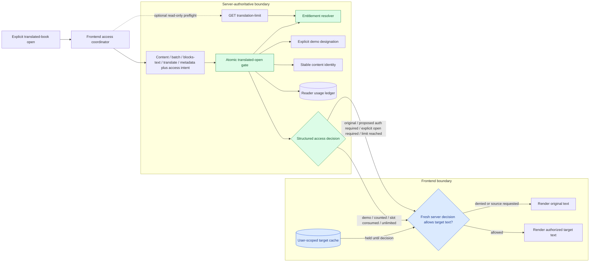
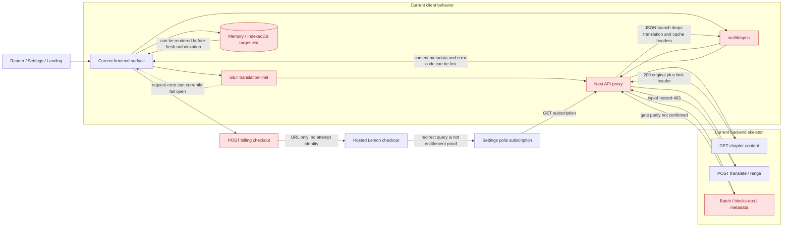

# RFC: Billing, entitlements, and translation access

## Status of this document

This RFC defines the target product and integration contract for paid access to translated
reading. It does not claim that every behavior below is implemented today.

The proposal combines:

- confirmed product decisions;
- the backend integration handoff received on 2026-09-01;
- the backend OpenAPI snapshot reviewed on 2026-09-01;
- the current frontend request, Reader, and cache behavior.

When the current backend differs from the confirmed product contract, this RFC records the
difference explicitly. The confirmed target is not silently changed to match an existing
implementation.

Normative language:

- **MUST**: required for launch correctness;
- **SHOULD**: expected unless a documented decision says otherwise;
- **MAY**: optional enhancement.

## Problem

Globoox needs a paid Premium plan without weakening the existing ability to read original
text. The feature crosses several independently timed systems:

1. translated-book usage in a rolling 30-day window;
2. commercial subscription and billing status;
3. effective product entitlement;
4. Lemon Squeezy checkout and asynchronous webhook activation;
5. Reader caches that may already contain translated text.

Without one contract, the frontend can infer access from stale billing fields, cached text can
bypass a server decision, and checkout success can be shown before the paid entitlement is
actually active.

## Goals

- Define the public plans `Free`, `Premium`, and `Editorial`.
- Keep translation access server-authoritative and race-safe.
- Define exactly what consumes a book slot and when a rolling period begins.
- Preserve original-language reading under every billing and quota state.
- Provide a resumable Lemon Squeezy checkout flow from Reader and non-Reader entry points.
- Normalize provider statuses into product states the frontend can render safely.
- Cover cached reads, re-uploads, concurrent opens, delayed webhooks, refunds, disputes, and
  subscription termination.
- Make the implementation independently testable across backend, frontend, and provider
  boundaries.

## Non-goals

- Offline reading or offline entitlement decisions.
- A self-service Editorial checkout.
- A free trial.
- Multiple currencies or multiple self-service paid products at launch.
- Making the frontend reproduce Lemon Squeezy billing logic.
- Blocking EPUB upload because a translated-reading limit has been reached.
- Replacing the existing translation orchestration architecture beyond the access boundary.

## Confirmed product contract

### Plans

| Plan | Commercial model | Translated books per rolling period | Primary action |
|---|---|---:|---|
| Free | Free forever | 2 | Current Plan |
| Premium | €5.90 per billing month, no trial | 6 | Get Started |
| Editorial | Custom pricing | Unlimited | Contact Us |

`Alpha` is an internal access override, not a public plan. `Pro` is not a launch plan and MUST
NOT appear in product copy, public plan enums, or frontend branching.

The Premium billing month and the translated-book rolling 30-day period are different clocks.
In product language this is called “rolling 30 days”, but its precise behavior is an anchored
30-day usage period: it starts on the first recorded translated open, not a continuously sliding
lookback over the previous 30 days.

### Landing pricing copy

The current approved working copy is:

```text
Eyebrow: READING WITHOUT BORDERS

H1: A plan for every reader

Subheader: From the occasional reader to the professional editor, find the plan that fits how you read.

Free
$0 / forever
2 books per month
Button: Current Plan

Premium
€5.90 / month
6 books per month
Button: Get Started

Editorial
Custom pricing
Unlimited books
Button: Contact Us
```

The interface MUST explain near the usage or pricing surface that “per month” means a rolling
30-day reading window, not a calendar month and not the Lemon Squeezy renewal period.

### Translation-access invariants

1. Original-language reading is always allowed.
2. Only explicitly designated demo books are quota-exempt.
3. Public or store books that are not demos count like any other non-demo book.
4. A non-demo book consumes a slot when its translated content is first actually opened in the
   active usage window, even when that translation was generated earlier or is fully cached.
5. Merely checking availability does not start a usage window or consume a slot.
6. Reopening a book already attributed in the active window consumes no additional slot.
7. Changing plan changes only the effective cap; it does not change the usage ledger or period
   dates.
8. When a paid entitlement ends, books already opened in the current window remain readable in
   translation. New books are blocked while the user is at or above the new cap.
9. A byte-identical EPUB represents the same quota identity. Deleting and re-uploading it MUST
   NOT free a slot or consume another one in the same period.
10. A byte-different EPUB is a different quota identity even if title and metadata are equal.
11. Demo books are the only confirmed public exemption. Future public/store books are not
    implicitly exempt.
12. One quota identity counts once per usage period regardless of requested target language,
    chapter, translation job, or cache source.
13. Demo exemption belongs to an explicitly designated demo distribution/book record. A user
    upload MUST NOT inherit exemption merely because its bytes match a demo EPUB.
14. Background discovery or prefetch MUST NOT start a period for a book the user has not
    explicitly opened in translation.
15. The original language must be known before the server classifies a target-language open. If
    metadata is incomplete, the server fails closed for target text while keeping source text
    available.

## Terminology and identities

| Term | Meaning |
|---|---|
| Billing cycle | Lemon Squeezy renewal clock for Premium |
| Usage window | Rolling 30-day clock anchored by an actual translated open |
| Entitlement | Server-resolved right to a cap or unlimited access |
| Counting book | Any non-demo book opened in a non-original language |
| Quota identity | Stable identity of the exact EPUB bytes, independent of a deletable user book record |
| Counted book | A quota identity already recorded for the reader in the active usage window |
| Access decision | Server result for one requested user, book identity, and language |
| Checkout attempt | Server-side record connecting an entry point, Lemon checkout, activation, and return context |
| Return context | Validated state needed to resume the originating surface after checkout |

The recommended quota identity is a canonical content fingerprint such as SHA-256 over the raw
EPUB bytes. The fingerprint does not need to be exposed publicly, but usage MUST NOT be cascade-
deleted with a user-visible `book_id`.

## Three independent state machines

### 1. Usage-window lifecycle

```mermaid
stateDiagram-v2
    state "No active period" as Dormant
    state "Active 30-day period" as Active
    state "Elapsed; awaiting an explicit open" as Elapsed

    [*] --> Dormant
    Dormant --> Dormant: preflight, original, demo, or background discovery
    Dormant --> Active: explicit translated non-demo open; record count = 1

    Active --> Active: reopen counted identity; count unchanged
    Active --> Active: open new identity with a slot; count + 1 atomically
    Active --> Active: open new identity at cap; deny and keep count
    Active --> Active: plan or renewal change; cap only
    Active --> Elapsed: serverNow >= periodEndsAt

    Elapsed --> Elapsed: preflight, original, demo, or background discovery
    Elapsed --> Active: next explicit counting open; create window and count = 1

    note right of Active
      Existing counted books remain readable.
      Original and explicit demo reads never consume a slot.
    end note
```



`GET /translation-limit` is read-only. Before the first recorded open,
`periodEndsAt` is `null`; the UI MUST show that no usage period has started instead of inventing
a reset date.

The operation that authorizes a translated read and records a new identity MUST be atomic. With
one slot remaining, two concurrent requests for different books must not both succeed.

Period comparisons use the backend clock and UTC instants. `now >= periodEndsAt` means the old
period has elapsed; the next explicit counting open creates the new period. Client timezone is
used only to format dates.

### 2. Subscription and entitlement lifecycle

Lemon Squeezy status is provider input. The backend maps it to a normalized effective
entitlement. The frontend MUST use that normalized entitlement rather than infer access from raw
provider status.

```mermaid
stateDiagram-v2
    state "Free; cap 2" as Free
    state "Premium active; cap 6" as Premium
    state "Cancelled grace; cap 6 until accessEndsAt" as CancelledGrace
    state "Past-due grace; cap 6" as PastDueGrace
    state "Billing hold; cap 2" as BillingHold
    state "Editorial active; unlimited" as Editorial
    state "Alpha override; unlimited" as Alpha

    [*] --> Free
    Free --> Premium: verified Premium activation
    Free --> Premium: unexpected on_trial; alert operations
    Premium --> Premium: renewal or partial refund
    Premium --> CancelledGrace: cancellation scheduled
    CancelledGrace --> Premium: resumed before accessEndsAt
    CancelledGrace --> Free: accessEndsAt reached
    Premium --> PastDueGrace: payment failed; retry grace starts
    PastDueGrace --> Premium: payment recovered
    PastDueGrace --> Free: grace exhausted, unpaid, or expired
    Premium --> Free: current entitlement fully refunded
    Premium --> BillingHold: chargeback or fraud dispute
    BillingHold --> Premium: dispute resolved with valid entitlement
    BillingHold --> Free: entitlement remains invalid
    Free --> Editorial: manual Editorial entitlement granted
    Editorial --> Premium: manual entitlement ended; valid Premium remains
    Editorial --> Free: manual entitlement ended; no other grant remains
    Free --> Alpha: internal override granted
    Alpha --> Editorial: override removed; valid Editorial remains
    Alpha --> Premium: override removed; valid Premium remains
    Alpha --> Free: override removed; no other grant remains

    note right of Premium
      Billing transitions never reset or move the usage period.
    end note
```



| Situation | Product state | Effective cap | User action |
|---|---|---:|---|
| No paid/manual entitlement | Free active | 2 | Upgrade |
| Premium active | Active | 6 | Manage subscription |
| Unexpected provider `on_trial` | Active configuration anomaly | 6 while provider grants access | Alert operations; do not advertise a trial |
| Premium cancelled before `endsAt` | Grace | 6 until `endsAt` | Manage or resume |
| Premium `past_due` during retry grace | Grace | 6 during configured grace | Update payment method |
| Payment recovered | Active | 6 | None |
| Premium `unpaid` or `expired` | Inactive | 2 | Resubscribe |
| Full refund of the currently entitlement-granting purchase | Inactive | 2 | Contact support or resubscribe |
| Partial refund | Unchanged | Unchanged | None unless support instructs |
| Chargeback or fraud dispute | Billing hold | 2 | Contact support |
| Editorial manual entitlement active | Active | Unlimited | Contact account owner |
| Editorial entitlement ended | Re-resolved | 6 if valid Premium remains; otherwise 2 | Manage Premium or contact sales |
| Alpha override | Active internal override | Unlimited | None |

Pause MUST be disabled in the launch Lemon Squeezy portal. If a legacy or unexpected paused
subscription is received, the backend must resolve it explicitly from provider pause semantics:
a pause that grants free service can retain Premium access; a void/no-service pause drops to the
Free cap. The frontend never decides this from the string `paused` alone.

Every transition in this table leaves the current usage window and its recorded identities
unchanged. To preserve the “already opened remains readable” rule after an Editorial downgrade,
Editorial reads SHOULD still be attributed in the usage ledger while the cap is not enforced.
Alpha may remain a separate fully exempt internal override.

A refund of an old invoice MUST NOT disable a newer valid subscription. Entitlement resolution
must identify whether the refunded transaction currently grants access.

The resolver recomputes the highest valid access source whenever one source changes; it does not
hardcode every removal to Free. Proposed precedence is internal Alpha/admin override, manual
Editorial, valid Premium active/grace, then Free. This precedence must be accepted with the
backend contract.

### 3. Checkout-attempt lifecycle

```mermaid
sequenceDiagram
    actor User
    participant Surface as Reader / Settings / My Books / Landing
    participant Frontend as Checkout coordinator
    participant Backend as Globoox backend
    participant Lemon as Lemon Squeezy

    User->>Surface: Select Get Started
    Surface->>Frontend: Start with source and return context

    alt Authentication required
        Frontend-->>User: Sign in or register
        User->>Frontend: Return with preserved intent
    end

    Frontend->>Backend: Create idempotent Premium attempt
    Backend->>Lemon: Create checkout with trusted custom data
    Lemon-->>Backend: Hosted checkout URL
    Backend-->>Frontend: attemptId and URL
    Frontend->>Lemon: Open overlay or hosted fallback
    Note over User,Lemon: Card, validation, tax, and 3DS states remain inside Lemon

    alt User closes or abandons checkout
        Lemon-->>Frontend: Closed without success
        Frontend-->>Surface: not_completed; entitlement unchanged
    else Provider reports payment success
        par Browser result
            Lemon-->>Frontend: Checkout.Success or hosted return
            Frontend->>Backend: Read attempt status
        and Signed provider event
            Lemon-->>Backend: Webhook; delivery order is arbitrary
            Backend->>Backend: Verify, deduplicate, and resolve entitlement
        end

        loop Until active or activation SLA expires
            Frontend->>Backend: Poll user-scoped attempt
            Backend-->>Frontend: payment_received, activating, or active
        end

        alt Entitlement active
            Frontend-->>Surface: Restore source context and retry intended action
        else Activation delayed
            Frontend-->>User: Do not pay again; Check again or contact support
        else Billing hold
            Frontend-->>User: Preserve purchase context and contact support
        end
    end
```

Definitions:

- Closing an overlay or navigating away is `not_completed`, not a payment failure.
- Card decline, validation, and 3DS errors remain inside Lemon Squeezy.
- A client-side `Checkout.Success` event means payment was reported by the provider UI; it does
  not grant product access.
- Access becomes paid only after the backend reports an active normalized entitlement.
- `activation_delayed` tells the user not to pay again and offers “Check again” and support.
- Refreshing the result page MUST recover the user-scoped attempt and continue polling.

## Architecture and responsibility boundaries

### TO-BE translated-access path

Only the affected access boundary is shown; translation workers, pagination, upload, and
original-language rendering remain outside this change.



The preflight is advisory and never grants access. If it is unavailable, the frontend may proceed
to the authoritative request, but it still cannot reveal target text without a fresh allowed
decision. The `auth_required` branch remains proposed until the guest policy is accepted.

### Backend

The backend is the sole authority for:

- plan and entitlement resolution;
- usage-window creation and expiration;
- quota identity and exact-file deduplication;
- atomic authorization and usage attribution;
- demo exemption;
- Lemon Squeezy webhook verification, idempotency, and ordering;
- checkout-attempt state;
- safe return-context persistence;
- normalized billing actions exposed to the frontend.

Every path that creates, returns, reconciles, or streams target-language content MUST call the
same access operation before returning translated text:

```text
authorizeTranslatedAccess(
  readerUserId,
  canonicalContentIdentity,
  requestedLanguage,
  accessIntent
)
```

The operation returns a structured decision such as:

```text
original
auth_required
quota_exempt_demo
already_counted
slot_consumed
explicit_open_required
limit_reached
unlimited
```

`accessIntent` is one of `explicit_open`, `continuation`, or `prefetch`:

- only `explicit_open` may atomically attribute a previously uncounted identity and start a
  period;
- `continuation` and `prefetch` may serve target text only when the identity is already counted,
  explicitly demo-exempt, or covered by an unlimited entitlement;
- otherwise they return `explicit_open_required` with no target text and no usage mutation.

This prevents background work from starting a period without letting a caller label an ordinary
read as prefetch to bypass attribution.

### Frontend

The frontend owns:

- entry-point presentation and pricing copy;
- early read-only quota checks for UX;
- Lemon overlay orchestration and hosted fallback;
- checkout-attempt polling and visible result states;
- return-context restoration;
- typed transport of backend errors and access decisions;
- ensuring local translated caches are not rendered before current server authorization;
- banners, actions, analytics, and accessibility.

The frontend MUST NOT:

- derive an effective cap from raw Lemon status;
- treat checkout UI success as entitlement activation;
- grant access because target text exists in memory or IndexedDB;
- start or reset the rolling period itself;
- decrement usage when a book is deleted;
- identify demo books from ownership or `user_id`.

### Lemon Squeezy

Lemon Squeezy owns:

- payment-method collection;
- card validation and 3DS;
- hosted checkout and provider UI errors;
- receipts, invoices, and supported tax handling;
- provider subscription events;
- the customer portal for Premium management.

Lemon Squeezy does not own Globoox usage windows or final product access decisions.
The landing displays the base €5.90 price; the final tax/VAT-inclusive amount shown and charged
in checkout remains Lemon Squeezy truth.

## Current backend handoff and required deltas

The backend handoff received on 2026-09-01 documents a useful skeleton:

- `GET /api/subscription`;
- `GET /api/translation-limit`;
- a hard `403 translation_limit_reached` for translate and translate-range;
- `POST /api/billing/checkout` returning a hosted checkout URL;
- `GET /api/billing/portal`;
- asynchronous subscription activation through webhooks.

### AS-IS affected path

This diagram records the current integration risks, not the desired implementation.



### Current endpoint snapshot

This table is descriptive **CURRENT** behavior from the handoff/OpenAPI, not the target schema:

| Endpoint | Current relevant contract |
|---|---|
| `GET /api/subscription` | Returns nullable `tier: premium | pro`, raw nullable `status`, `renewsAt`, `endsAt`, `isSubscribed`, `isPro`, `limit`, `periodDays`, `price`, and `currency`; unauthenticated calls receive Free/guest defaults |
| `GET /api/translation-limit` | Read-only `{ allowed, count, limit, periodEndsAt }`; optional `exclude_book_id` represents the book about to be opened; unauthenticated calls currently report allowed |
| `POST /api/chapters/{id}/translate` | Returns nested `403 data.error = translation_limit_reached` with count, limit, and period end when the current hard gate denies work |
| `POST /api/chapters/{id}/translate-range` | Uses the same documented hard denial |
| `GET /api/chapters/{id}/content` | OpenAPI describes a `200` original-content fallback with `X-Translation-Limit-Reached`; the current frontend proxy drops that header |
| `POST /api/billing/checkout` | Accepts optional `redirectUrl` and returns only `{ url }` for hosted checkout |
| `GET /api/billing/portal` | Returns `{ url }` for card, invoice, and cancellation management |

The live frontend also consumes translated-content/reconciliation routes not present in the
reviewed OpenAPI snapshot, including block-text reconcile and reader-metadata translation. Their
access behavior requires backend confirmation and inclusion in the generated contract.

It also documents behavior that conflicts with the confirmed target:

| Area | Current handoff | Target contract | Severity |
|---|---|---|---|
| Public books | `books.user_id IS NULL` is exempt | Only explicit demo is exempt | Launch blocker |
| Guests | Translation is always allowed | Must not create an unlimited quota bypass; final auth policy must be accepted | Launch blocker |
| Re-upload | New `book_id`; delete cascades usage | Exact bytes retain quota identity and usage | Launch blocker |
| Plans | Free, Premium, internal Alpha, reserved Pro | Public Free, Premium, Editorial; Alpha is override; no Pro UI | Launch blocker |
| Checkout result | URL only; poll subscription after redirect | Attempt ID with observable activation state and saved return context | Required for robust resume UX |
| Provider statuses | Raw status with no complete policy | Normalized entitlement and action | Launch blocker |
| Hard gate | Explicitly documented for translate/range | Same gate on every translated-content path | Launch blocker |
| Trial | `on_trial` appears as a possible status | No trial is offered | Defensive mapping only |

The backend guide also states that the Next proxy forwards payloads verbatim. That is true for
the JSON body but not for all response headers: the current JSON proxy reconstructs responses
and does not forward the translation-limit, ETag, or cache-control headers needed by the Reader.

## API contract proposal

The exact payload schemas remain owned by the backend OpenAPI. The shapes below define the
minimum product semantics that OpenAPI must express before frontend activation.

### Public plan catalog

`GET /api/billing/plans` SHOULD be the public source for plan capabilities and price metadata:

```ts
type Plan = {
  id: 'free' | 'premium' | 'editorial'
  priceModel: 'free' | 'fixed' | 'custom'
  amountMinor: number | null
  currency: 'EUR' | null
  billingInterval: 'month' | null
  bookLimit: 2 | 6 | null
  usagePeriodDays: 30
  checkout: boolean
  contact: boolean
  trialDays: 0
}
```

Until this exists, the landing presentation may use a single typed frontend catalog, but plan
facts MUST NOT be duplicated across unrelated components.

### Subscription snapshot

`GET /api/subscription`:

```ts
type SubscriptionResponse = {
  plan: 'free' | 'premium' | 'editorial'
  accessSource: 'free' | 'lemonsqueezy' | 'manual_editorial' | 'alpha' | 'admin'
  billingStatus:
    | 'none'
    | 'active'
    | 'cancelled'
    | 'past_due'
    | 'unpaid'
    | 'expired'
    | 'paused'
    | 'refunded'
    | 'chargeback'
  entitlementStatus: 'active' | 'grace' | 'inactive' | 'billing_hold'
  actionRequired: 'none' | 'update_payment_method' | 'resubscribe' | 'contact_support'
  limit: 2 | 6 | null
  periodDays: 30
  renewsAt: string | null
  accessEndsAt: string | null
  canCheckout: boolean
  canManageBilling: boolean
  price: string | null
  currency: 'EUR' | null
}
```

Legacy fields such as `tier`, `isSubscribed`, and `isPro` may be supported by a temporary
adapter. New UI branches only on the normalized fields.

### Read-only usage check

`GET /api/translation-limit?book_id=<bookId>`:

```ts
type TranslationUsageResponse = {
  allowed: boolean
  reason:
    | 'auth_required'
    | 'original'
    | 'slot_available'
    | 'already_counted'
    | 'limit_reached'
    | 'quota_exempt_demo'
    | 'unlimited'
  count: number
  limit: 2 | 6 | null
  remaining: number | null
  periodDays: 30
  periodStartsAt: string | null
  periodEndsAt: string | null
  serverNow: string
  alreadyCounted: boolean
  wouldConsumeSlot: boolean
}
```

The current `exclude_book_id` parameter may remain as a compatibility alias, but `book_id`
better describes the candidate being checked. This endpoint MUST remain read-only.

### Authoritative content decision

Read endpoints SHOULD return a structured access envelope:

```ts
type ChapterContentResponse = {
  blocks: ContentBlock[]
  servedLanguage: string
  access: TranslationAccessDecision
}
```

When translated access is denied, a read endpoint may return original blocks with
`access.reason = 'limit_reached'`. Translation commands and streams return a typed error:

```ts
type TranslationLimitError = {
  error: 'translation_limit_reached'
  message: string
  count: number
  limit: number
  periodEndsAt: string | null
  bookAlreadyCounted: false
}
```

The implementation may retain an `X-Translation-Limit-Reached` compatibility header, but a
header alone is not the long-term product contract.

The same gate applies to at least:

- `GET /api/chapters/{id}/content`;
- cross-chapter batch content;
- `POST /api/chapters/{id}/blocks/text`;
- `POST /api/chapters/{id}/translate`;
- `POST /api/chapters/{id}/translate-range`;
- reader metadata and chapter-title translation;
- any cache, reconcile, backfill, export, or future endpoint that can expose target text.

Each target-content request carries or derives the access intent. Reader entry uses
`explicit_open`; subsequent requests for that active book use `continuation`; speculative work
uses `prefetch`. A non-activating request for an uncounted identity receives
`explicit_open_required` and no target payload.

Responses MUST NOT expose an unrestricted raw `translations` map after a denied decision.

### Checkout creation and status

`POST /api/billing/checkout`:

```ts
type CreateCheckoutRequest = {
  plan: 'premium'
  source: 'reader' | 'settings' | 'my_books' | 'landing' | 'account_menu'
  idempotencyKey: string
  returnContext?: {
    bookId?: string
    language?: string
    chapterId?: string
    anchor?: string
  }
}

type CreateCheckoutResponse = {
  attemptId: string
  url: string
  provider: 'lemonsqueezy'
  expiresAt: string | null
}
```

`GET /api/billing/checkout-attempts/{attemptId}`:

```ts
type CheckoutAttemptResponse = {
  state:
    | 'created'
    | 'payment_received'
    | 'activating'
    | 'active'
    | 'expired'
    | 'failed'
    | 'billing_hold'
  plan: 'premium'
  entitlementActive: boolean
  updatedAt: string
  returnContext: Record<string, string> | null
}
```

Requirements:

- attempts are user-scoped;
- repeated creation with the same idempotency key returns the same usable attempt;
- active Premium or Editorial users do not receive a second subscription checkout;
- the backend constructs or validates only same-origin relative return paths;
- Lemon custom data includes user ID, attempt ID, and requested plan;
- the frontend never trusts query parameters as proof of payment.

The overlay is the preferred desktop interaction when the provider integration is available.
The same hosted URL is the fallback for blocked popups, mobile browsers, provider-script failure,
or accessibility/browser constraints. Both paths converge on the same attempt and result state.

Typed creation errors:

| Status | Code | Frontend behavior |
|---:|---|---|
| 401 | `auth_required` | Save intent and authenticate |
| 409 | `already_subscribed` | Refresh subscription and offer portal |
| 422 | `invalid_return_context` | Drop unsafe context and use a safe default |
| 502 | `provider_error` | Retry without losing source context |
| 503 | `billing_unavailable` | Explain temporary unavailability |

### Billing portal

`GET /api/billing/portal` returns a required URL. The backend SHOULD accept only a validated
same-origin return path. `portal_not_available` is a typed outcome for Free and manual
Editorial users.

Pause is disabled for launch. Portal actions do not directly change frontend entitlement; the
backend subscription snapshot remains authoritative after webhook synchronization.

### Editorial contact

Editorial is not a Lemon checkout. A separate guest-capable endpoint is required instead of
reusing a waitlist endpoint:

```ts
type EditorialContactRequest = {
  name: string
  email: string
  companyOrPublication?: string
  role?: string
  expectedVolume?: string
  message?: string
}
```

The endpoint MUST be rate-limited, return a trackable request ID, and have a defined delivery
owner. An authenticated user's known fields may be prefilled.

## Cache and proxy safety

The Reader currently has memory and IndexedDB target-text caches. Existence of cached translated
text is not proof of current access.

Required behavior:

1. The Reader may show cached original structure immediately.
2. It MUST NOT reveal target-language text for a new opening until the server has authorized the
   current user, quota identity, and requested language.
3. The access gate runs before conditional `304` handling.
4. A stale translated ETag from a different user, expired window, or previous entitlement cannot
   authorize a client cache hit.
5. Translated cache data is at minimum user-scoped and keyed by book/content identity, language,
   and content version.
6. The Next proxy forwards the agreed `ETag`, `Cache-Control`, `X-Translation-*`, request ID, and
   rate-limit headers while compatibility headers exist.
7. `src/lib/api.ts` preserves HTTP status, typed error code, structured body, and access metadata.
8. A denied translated read falls back to original text without leaking target text through raw
   block properties, metadata, prefetched chapters, or recovery endpoints.

## UX surface/state matrix

This matrix is the target projection for only the surfaces changed by this feature. It is the
input to low-fidelity wireflows; it does not prescribe high-fidelity layout.

| Surface | Preconditions and trigger | Visible state | Primary action | Result or return |
|---|---|---|---|---|
| Reader | Original language selected | Existing Reader; no billing interruption | Read | Reader remains in original |
| Reader | Demo translation requested | Translation opens without usage copy | Read | Demo remains quota-exempt |
| Reader | Target text exists locally; fresh access decision pending | Original structure plus checking/loading treatment; cached target hidden | Wait or switch to original | Apply server decision when received |
| Reader | Book is already counted in active period | Translation opens; no limit dialog | Read | Count and period unchanged |
| Reader | Free has an available slot; explicit new translated open | Normal Reader loading | Read | Backend records one identity atomically |
| Reader | Guest requests counting translation | Proposed auth-required continuation; final guest policy remains open | Sign in / Register | Return to the same book and retry access |
| Reader | Free at `2/2` requests a new book | Limit dialog with usage and reset date | Get Started | Create Premium checkout attempt |
| Reader | Premium at `6/6` requests a new book | Limit dialog with Editorial value | Contact Us | Open Editorial lead flow |
| Reader | Downgraded user reopens an identity recorded this period | Translation opens even when current count exceeds cap | Read | No clawback and no new usage |
| Reader | Downgraded user over cap requests a new identity | Limit dialog based on normalized current plan and achievable next cap | Upgrade or Contact Us | Premium when it creates headroom; otherwise Editorial |
| Reader | Backend access check fails or network is unavailable | Original remains readable; no fail-open target text | Retry | Recheck access; offline entitlement is unsupported |
| Reader | Checkout closes or is abandoned | Same book, chapter, anchor, and original text | Try again or continue original | No entitlement change |
| Reader | Entitlement becomes active | Brief success state | Continue reading | Restore language, chapter, logical anchor; retry translated read |
| Settings / Billing | Free; no usage period | Free, `0/2`, no reset date | Upgrade | Shared checkout coordinator |
| Settings / Billing | Free; active usage period | Free, used/2, usage reset date | Upgrade | Shared checkout coordinator |
| Settings / Billing | Premium active | Premium, used/6, renewal date | Manage subscription | Lemon Customer Portal |
| Settings / Billing | Premium cancelled in grace | Premium until access end; cancellation banner | Manage or Resume | Portal; refresh normalized subscription afterward |
| Settings / Billing | Premium `past_due` within grace | Payment-problem banner; Premium cap retained during policy grace | Update payment method | Portal; recover through backend state |
| Settings / Billing | `unpaid`, `expired`, or current full refund | Free cap and ended-access copy | Resubscribe | New Premium checkout attempt |
| Settings / Billing | Chargeback or fraud hold | Billing-hold banner; Free cap | Contact support | Support/reconciliation path |
| Settings / Billing | Editorial active | Editorial, unlimited, no Lemon management CTA | Contact account owner | Manual account path |
| Settings / Billing | Alpha override | Internal unlimited-access presentation; no public Alpha plan card | None | No commercial transition |
| Checkout coordinator | Checkout creation in progress | Progress state; duplicate CTA disabled | Wait | Preserve source context |
| Checkout coordinator | Checkout creation fails | Inline non-payment error | Try again | Retry from the same source |
| Checkout coordinator | Backend reports an active subscription | No second checkout or payment | Continue / Manage | Refresh subscription and return safely |
| Billing result | Attempt created; payment not confirmed | Verifying or incomplete state without success claim | Return or retry safely | Source context remains stored |
| Billing result | Payment received; webhook/entitlement pending | “Payment received, activating…” | Wait | Poll same attempt |
| Billing result | Activation exceeds SLA | “Do not pay again” delayed state | Check again / Contact support | Continue same attempt |
| Billing result | Entitlement active from Reader | Success confirmation followed by automatic resume | Continue reading | Restore book, language, chapter, logical anchor; retry translated read |
| Billing result | Entitlement active from Settings, My Books, Landing, or account menu | Success banner | Continue | Billing, My Books, product Billing, or the originating app route |
| Billing result | Attempt expired or checkout not completed | Neutral incomplete state | Try again / Return | No payment-failure accusation |
| Billing result | Attempt enters billing hold | Purchase recorded but access needs review | Contact support | Preserve attempt and source context |
| Billing result | Session expired while checking attempt | Authentication-required state; no access inference | Sign in | Resume the same user-scoped attempt |
| Billing result | Attempt ID is invalid or unrecoverable | Safe recovery without an activation promise | Go to Billing / Contact support | Settings / Billing |
| Landing pricing | Anonymous visitor selects Premium | Auth continuation with pricing intent preserved | Sign in / Register | Automatically resume Premium checkout |
| Landing pricing | Signed-in Free user selects Premium | Checkout creation state | Get Started | Shared checkout coordinator |
| Landing pricing | Premium or Editorial user views cards | Contextual current/manage state; no duplicate checkout | Manage or Continue | Portal or product |
| Landing pricing | Visitor selects Editorial | Editorial lead entry | Contact Us | Contact form, never Lemon checkout |
| Landing Free card | Anonymous visitor | CTA copy remains an explicit open product decision | TBD | No implementation assumption |
| Editorial contact | Form idle | Name, work email, organization/role, volume, message | Submit | Server-owned lead receipt |
| Editorial contact | Submitting | Disabled duplicate submit with accessible progress | Wait | Success or recoverable error |
| Editorial contact | Submitted | Confirmation and expected response path | Return | Landing or originating surface |
| Editorial contact | Validation, delivery, network, or rate-limit error | Field-level or retry-later error; entered values retained | Correct / Retry | Same form |
| My Books | Below cap | Compact used/cap/reset indicator; upload remains enabled | Optional Upgrade for Free | Reader remains authoritative |
| My Books | Free at `2/2` or Premium at `6/6` | Compact limit state; upload remains enabled | Upgrade or Contact Us | Checkout or Editorial form |
| My Books | Any quota state; user uploads EPUB | Upload remains enabled | Upload | Quota is evaluated only on translated open |
| Account menu | Free | Compact Upgrade action | Upgrade | Shared checkout coordinator |
| Account menu | Premium | Manage subscription action | Manage | Portal |
| Account menu | Editorial | Account/contact action | Contact | Manual account path |

The matrix intentionally excludes Lemon card forms, 3DS, Customer Portal internals, unchanged
Reader controls, unchanged authentication screens, upload internals, and translation-worker UI.

All checkout entry points pass through a product-owned `/billing/result` activation state before
the source-specific return in the matrix. Reader return context is stored server-side with the
attempt; the browser carries only an opaque attempt ID and validated internal destination.

If the session expires, the user authenticates again before the attempt is read. If the book was
deleted, the language is no longer supported, or the saved anchor is stale, activation still
succeeds and the user falls back to the nearest safe product surface without losing entitlement.
Checkout completed on another device uses the same backend state; only local navigation context
may be absent. Card decline, address validation, and 3DS remain provider-owned states.

## UX entry points

### Reader quota gate

This is the highest-intent entry point.

- Free: attempting to open a third new non-demo book in translation shows Premium value and
  `Get Started`.
- Premium: attempting to open a seventh new book shows the Editorial `Contact Us` path.
- Reopening a counted book never shows the limit dialog solely because the count equals the cap.
- An already-generated or cached translation follows the same gate.
- Original text remains readable behind or after the dialog.
- Upload remains available because upload itself is not quota consumption.

The read-only preflight improves UX, but the actual content response is authoritative. The UI
must handle a race-safe limit response even after a successful preflight.

### Settings / Billing

Settings shows:

- current public plan;
- used and available books;
- no reset date before a usage window begins;
- usage reset date when present;
- a separate renewal or access-end date;
- Upgrade, Manage subscription, Update payment method, Resubscribe, or Contact support based on
  normalized backend actions;
- activation and lifecycle banners.

### My Books

My Books MAY show a compact usage indicator and contextual action. It does not disable upload.
Selecting a book still relies on the Reader's authoritative gate.

### Landing pricing

- `Get Started` for Premium saves the landing intent.
- An unauthenticated user authenticates first and then resumes checkout automatically.
- `Contact Us` opens the Editorial lead flow.
- The pricing block is enabled behind a feature flag only after the billing critical path passes
  staging tests.

### Account menu

Free users MAY see a compact Upgrade action. Premium users see Manage subscription. Editorial
users see their account/contact action. This is a convenience entry point, not a separate flow.

## Webhook and reconciliation requirements

The backend webhook pipeline MUST:

- verify the signature over the raw request body;
- persist provider event IDs and be idempotent;
- tolerate duplicate and out-of-order delivery;
- map create, update, cancel, resume, expire, payment failure, recovery, refund, and dispute
  events used by the product;
- associate events with user ID, attempt ID, and plan through trusted custom data;
- acknowledge unknown but valid events without corrupting state;
- expose metrics for paid attempts not activated within the expected SLA;
- support provider reconciliation so a missed webhook is eventually corrected.

Redirect order is not meaningful. “Webhook before browser return” and “browser return before
webhook” must converge to the same active state.

## Analytics

PostHog is the current product analytics provider. Events MUST contain plan, source, normalized
state, and non-sensitive identifiers where useful; they MUST NOT contain card data or checkout
form contents.

Minimum event family:

- `translation_limit_reached`;
- `premium_upgrade_clicked` with every source;
- `billing_checkout_create_started`;
- `billing_checkout_opened`;
- `billing_checkout_not_completed`;
- `billing_payment_received`;
- `billing_activation_delayed`;
- `subscription_activated`;
- `billing_portal_opened`;
- `editorial_contact_started`;
- `editorial_contact_submitted`.

Provider-side failure events that the browser cannot observe should come from backend webhook or
operational telemetry rather than guessed client events.

## Accessibility and localization

- Overlay use follows the canonical product overlay primitives and focus behavior.
- Limit and billing states are announced without relying on color alone.
- Loading state prevents duplicate activation but retains an accessible status message.
- Dates are formatted in the user's locale and timezone while preserving exact server instants.
- “Reset” and “renew” copy are distinct in every locale.
- Pricing copy, lifecycle banners, result messages, and Editorial form validation are localized
  across the supported surfaces before public enablement.

## Security and privacy

- Checkout and portal URLs are created only by the authenticated backend.
- Return paths are allowlisted same-origin relative paths.
- Attempts are opaque and user-scoped.
- Webhook signatures use raw bodies and secrets never reach the browser.
- Editorial contact is rate-limited and follows the product's consent and retention policy.
- Logs and analytics exclude card data, provider secrets, signed URLs, and unnecessary PII.
- Generic translation endpoints that cannot associate work with a book identity must be internal,
  admin-only, or governed by a separately documented policy.

## Acceptance test matrix

### Usage and access

1. A new Free user can repeatedly check usage and remains at `0/2` with no active period.
2. Reading original text does not create a usage window.
3. First translated non-demo open records `1/2` and starts exactly 30 days.
4. A fully cached translated open records usage exactly like newly translated content.
5. The second new book records `2/2`; the third exposes no target text through any endpoint.
6. The first two books remain readable at `2/2`.
7. Demo reading does not create a window or increment count.
8. A public/store non-demo book counts.
9. A book attributed to another uploader counts for the current reader.
10. Upgrade at `2/2` becomes `2/6` without changing `periodEndsAt`.
11. Renewal does not change count or usage dates.
12. Premium ending at `5/2` keeps the five recorded books readable and blocks a new one.
13. Exact-byte delete/re-upload remains counted without a second slot.
14. Byte-different content is a new quota identity.
15. Two different books racing for one slot allow exactly one.
16. Two concurrent opens of one identity both succeed and increment once.
17. The first actual open after an expired window creates exactly one new window.
18. A stale translated ETag never produces an unauthorized `304` cache reuse.
19. No translated content leaks through block maps, metadata, chapter batches, reconcile, or
    prefetch paths.
20. Cross-user file dedup shares storage identity safely but keeps usage ledgers reader-specific.
21. Background prefetch for an unopened book cannot create its first usage record.
22. Switching target languages or chapters within one counted book does not increment usage.
23. Unknown or malformed original-language metadata cannot expose target text.
24. `continuation` or `prefetch` for an uncounted non-demo identity returns
    `explicit_open_required`, no target payload, and no usage mutation.

### Billing and checkout

1. Double-clicking Get Started creates or reuses one attempt and one provider checkout.
2. Guest intent survives sign-in, registration, and OAuth return.
3. Closing the overlay leaves the existing entitlement unchanged.
4. Provider decline remains in checkout and permits correction/retry.
5. Webhook before return activates successfully.
6. Return before webhook shows activating and later converges to active.
7. Refresh during activation resumes the same attempt.
8. Activation delay never invites a second payment.
9. Active Premium/Editorial cannot start a duplicate Premium subscription.
10. Cancelled Premium retains cap through `accessEndsAt` and then drops without resetting usage.
11. `past_due -> recovered` preserves window and count.
12. `unpaid`, `expired`, current full refund, and chargeback follow the lifecycle table.
13. A partial refund and an old-invoice refund do not incorrectly remove a valid entitlement.
14. Duplicate or older webhooks cannot overwrite newer provider state.
15. Editorial contact never opens a Lemon checkout.
16. Ending Editorial or Alpha falls back to a still-valid lower entitlement before Free.

### Frontend

1. Proxy tests prove agreed translation, cache, request, and rate-limit headers survive.
2. Typed API errors preserve HTTP status, code, and structured quota data.
3. IndexedDB target text is hidden until the current access decision allows it.
4. Reader fallback remains usable in original language under every denial state.
5. Reader return restores the logical block anchor rather than a derived page number.
6. `periodEndsAt === null` does not render a fake reset date.
7. Billing renewal and usage reset dates use different labels.
8. Free `2/2` routes to Premium; Premium `6/6` routes to Editorial.
9. Every entry point uses the same checkout coordinator and result state machine.
10. Unsafe external return paths are rejected.

## Delivery plan and dependencies

```text
B0 API contract
├─ B1 quota identity + atomic access gate ──────────────┐
├─ B2 normalized entitlement resolver ─┬─ B3 webhooks ─┤
│                                      └─ B4 attempts ─┤
├─ B5 Editorial lead endpoint                          │
└─ F0 frontend transport and fixtures                  │
   └─ F1 checkout coordinator ─┬─ F2 Reader ───────────┤
                               ├─ F3 Settings/My Books │
                               └─ F4 Landing/Editorial │
                                                         v
                                                    E2E + rollout
```

### B0: contract

- Resolve every blocking delta in this RFC.
- Update generated OpenAPI, including every live translated-content endpoint.
- Remove public `Pro` terminology and add Editorial/manual entitlement semantics.
- Publish shared fixtures for frontend contract tests.

### B1: quota and gate

- Add explicit demo exemption.
- Move usage identity away from deletable `book_id` if required.
- Put one atomic gate in every translated-content path.
- Add concurrency, cache, re-upload, and leakage integration tests.
- Migrate demo designation and stable content identity without turning ordinary public books into
  exempt books.

### B2-B4: entitlement, webhook, and checkout

- Normalize provider states and actions.
- Make webhook processing idempotent and order-safe.
- Add checkout attempts, idempotent creation, and activation polling.
- Reconcile existing Premium subscriptions and isolate legacy `pro`/Alpha records from public
  plan identity.

### F0-F4: frontend

- Preserve typed transport metadata.
- Gate local cache rendering.
- Implement one checkout coordinator and source restoration.
- Add Reader, Settings, My Books, Landing, and Editorial surfaces behind flags.

## Rollout and rollback

Recommended feature flags:

- `translation_quota_v2_enabled`;
- `premium_checkout_enabled`;
- `landing_pricing_enabled`;
- `editorial_contact_enabled`.

Rollout order:

1. Configure Lemon Squeezy test mode for Premium €5.90/month, no trial, pause disabled.
2. Deploy the backend contract, access gate, entitlement resolver, attempts, and webhook telemetry.
3. Replay representative webhook fixtures and run reconciliation tests.
4. Deploy frontend transport, checkout, and pricing with public flags off.
5. Run staging E2E for both webhook/return orders, close, refresh, decline, duplicate click,
   downgrade, and cached-reader cases.
6. Enable Settings and Reader entry points for an internal cohort.
7. Observe activation latency, duplicate attempts, quota denials, cache leakage, and support load.
8. Enable landing pricing.
9. Enable Editorial contact when its delivery owner and SLA are ready.

Rollback:

- Disable checkout and marketing entry points without deleting subscription or usage records.
- If quota enforcement must be disabled, preserve the ledger for later reconciliation and keep
  original reading available.
- Never roll back by granting access from client state or query parameters.
- Provider webhooks continue to be acknowledged and recorded even while checkout UI is disabled.

## Success criteria

- No target-language content can be obtained for a denied new book through direct, cached,
  prefetched, metadata, or conditional-request paths.
- The rolling window and billing cycle remain observably independent.
- All checkout entry points converge on one resumable activation flow.
- A paid user never needs to pay twice because a webhook was delayed.
- Plan, usage, renewal, cancellation, payment-problem, and contact states are understandable
  without support intervention in normal cases.
- Backend integration tests and frontend contract/E2E tests cover the acceptance matrix.
- Production metrics distinguish checkout creation, payment received, activation, delay, and
  entitlement loss.

## Open decisions before acceptance

1. **Guest non-demo translation:** recommended launch policy is demo and original access for
   guests, with sign-in required before any counting translated read. The current backend handoff
   says guests are always allowed, which would bypass per-user limits.
2. **Free-card guest CTA:** approved working copy says `Current Plan`; decide whether anonymous
   visitors instead see a contextual `Start reading` action.
3. **Activation SLA:** choose the normal polling duration and the threshold for
   `activation_delayed`.
4. **Editorial delivery:** choose CRM/helpdesk/email destination, owner, and response SLA.
5. **Exact-file identity implementation:** backend must confirm or change its current
   `book_id`/cascade behavior and provide passing integration evidence.
6. **Paused legacy records:** confirm the exact provider pause-mode mapping used by the
   entitlement resolver.
7. **Quota-identity retention:** define how long a fingerprint-only usage tombstone is retained
   after deletion so dedup semantics and privacy/account-deletion policy agree.
8. **Entitlement-source precedence:** accept or revise the proposed Alpha/admin → Editorial →
   Premium → Free order when multiple grants coexist.

## Ownership

| Area | Owner |
|---|---|
| Plans, pricing copy, lifecycle policy | Product |
| Entitlements, usage ledger, dedup, webhooks, OpenAPI | Backend |
| Checkout UX, cache gate, return context, proxy | Frontend |
| Lemon configuration, reconciliation, incident response | Engineering / Operations |
| Editorial lead processing | Sales / Product, to be assigned |

## Documentation lifecycle

This RFC remains `active` while the contract or implementation is incomplete.

Before implementation starts, the server-authoritative entitlement and usage decision should be
recorded in a proposed ADR. The ADR becomes accepted only when the contract is agreed; accepted
ADRs are not rewritten later and are superseded by a new record when the architecture changes.

When behavior ships:

1. create the current product reference for billing, entitlements, and usage;
2. update the current API/sync, translation, marketing, and analytics references in the same
   behavior-changing pull requests;
3. add the Lemon Squeezy subscription runbook before public enablement;
4. record actual implementation links and deviations here;
5. set this RFC to `implemented` and move it to `docs/rfcs/accepted/`;
6. validate documentation with `npm run docs:check`.

`last_verified` is updated only after comparison with code, tests, and authoritative OpenAPI.

## Decision log

| Date | Status | Decision |
|---|---|---|
| 2026-09-01 | Confirmed | Public plans are Free, Premium, and Editorial; there is no public Pro plan |
| 2026-09-01 | Confirmed | Free is 2 and Premium is 6 books per anchored rolling 30-day usage period |
| 2026-09-01 | Confirmed | Premium is €5.90/month with no trial; Editorial is custom and unlimited |
| 2026-09-01 | Confirmed | Only explicitly designated demo books are exempt; other public/store books count |
| 2026-09-01 | Confirmed target, backend conflict | Exact-byte re-upload retains quota identity and does not free or consume another slot |
| 2026-09-01 | Proposed | Backend-normalized entitlement, checkout attempts, and resumable result flow |
| 2026-09-01 | Proposed | Non-activating prefetch intent and deterministic entitlement-source precedence |

## Resolution

Not resolved. The RFC is active. Resolve the open decisions, accept the architecture boundary,
and attach backend/frontend contract-test evidence before marking it implemented.
