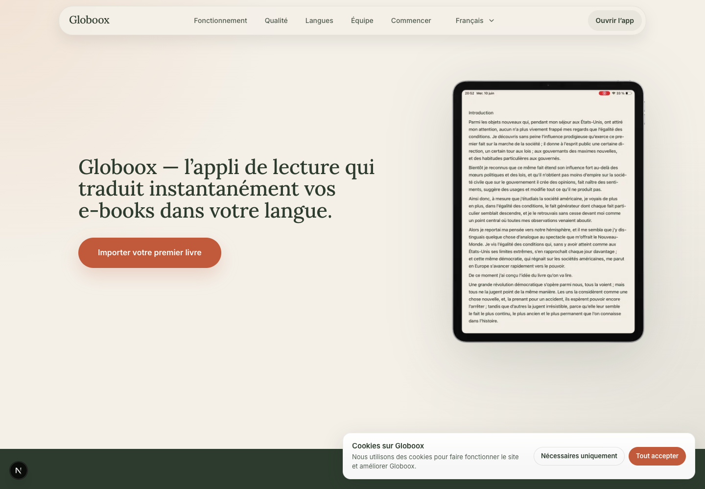
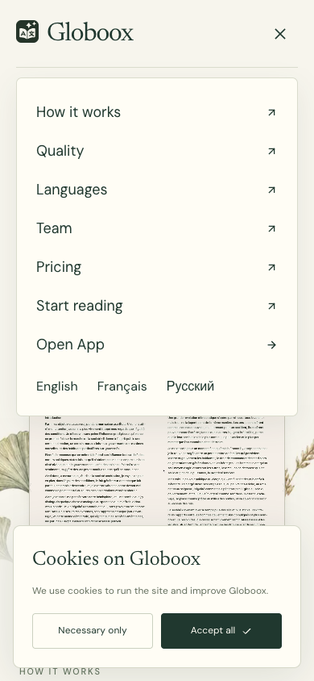
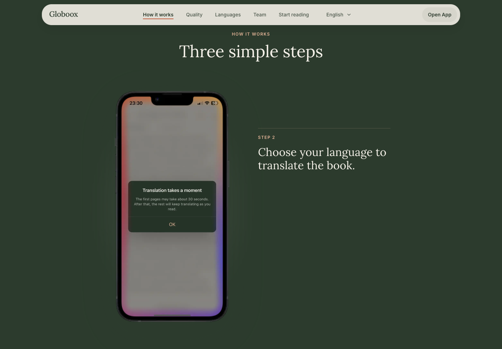
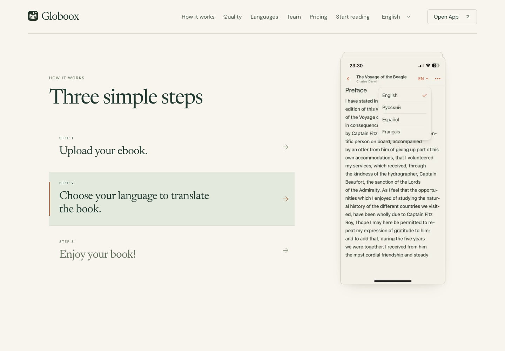
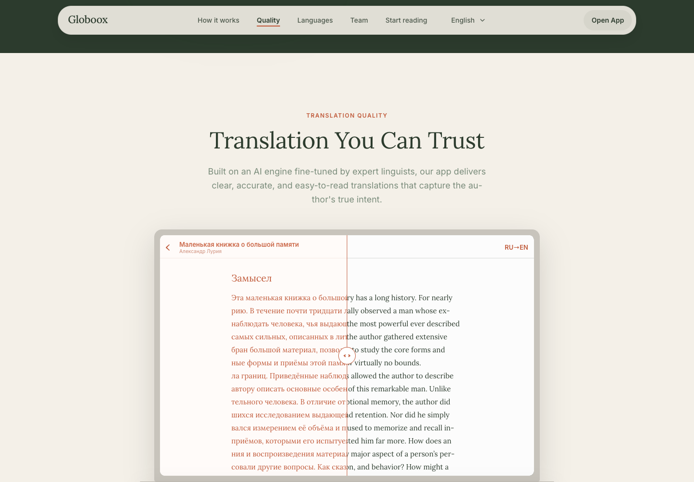
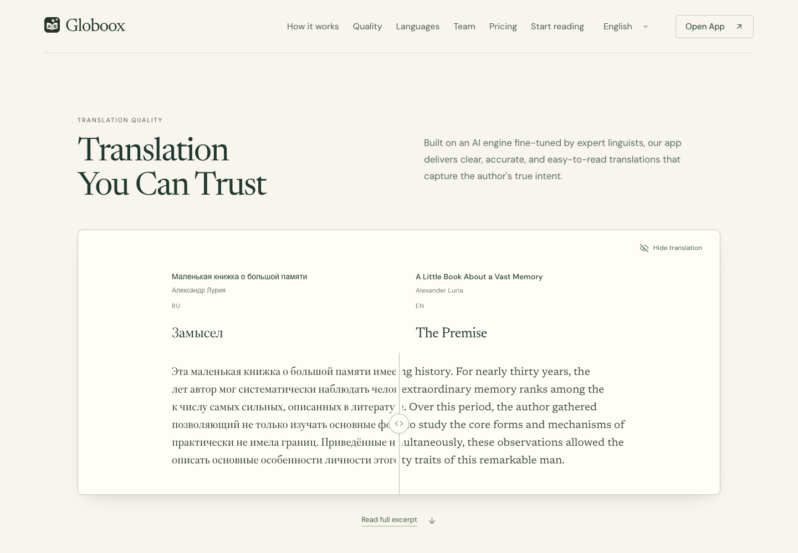
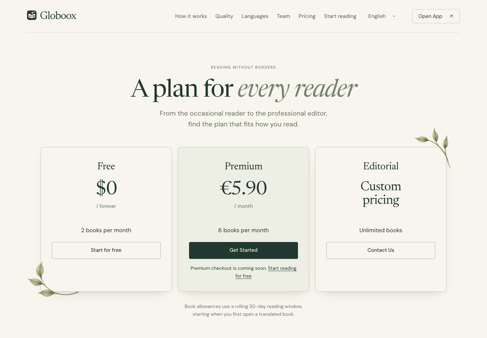

# Функциональное сравнение старого и нового лендинга

**Результат: основной сценарий перенесён, полной функциональной эквивалентности пока нет.** Самые существенные отличия — отсутствие локализованного editorial и подсветки текущего раздела. В How it Works стало меньше объясняющих состояний. Premium пока не открывает оплату.

Это аудит по запросу пользователя, **не реализация исправлений и не разрешение менять текущий дизайн**. Исходники приложения и лендингов в рамках проверки не изменялись. Коммита, push и деплоя не было. Все предыдущие визуальные решения и ассеты сохраняются; старый проект остаётся вторичным визуальным ориентиром, но действующим эталоном для сравнения доступных функций.

## База и метод

Сравнивались локальные `http://localhost:3000/en` и `http://localhost:3000/landing-editorial`. Канонический старый лендинг собирается в `src/components/landing/LocalizedLandingPage.tsx`. Архивный `/landing`, backup-страницы и не подключённые компоненты не считаются доказательством существовавшей функции.

Свежие анонимные сессии установленного Chrome через Playwright: 1440×1000 и мобильный viewport 390×844, без доступа к пользовательскому профилю. In-app Browser не запустился из-за отсутствующего модуля browser-service; использован локальный браузерный fallback. Два независимых чтения кода охватили навигацию/инфраструктуру и продуктовые блоки. Приведённые ниже скриншоты открыты и визуально проверены.

## Сопоставление по сценарию посетителя

| Этап | Старый `/en` | Новый `/landing-editorial` | Вывод |
| --- | --- | --- | --- |
| 1. Открыть приложение | Open App и обе Upload your first book ведут в `/my-books` | Те же назначения, обычные ссылки | Перенесено; вход и загрузка книги внутри приложения не проходились |
| 2. Посмотреть продукт | Реальная запись, в каноническом hero выбран Tablet | Те же реальные записи; Desktop/Tablet/Phone, начальный выбор по viewport, autoplay | Перенесено и расширено; все три видео воспроизводятся |
| 3. Перейти к разделу | Якоря, мобильное меню, активный пункт | Якоря с учётом sticky-шапки и обходом длинной анимации, мобильное меню | Переходы работают; активный пункт отсутствует |
| 4. Сменить язык сайта | Локализованные страницы; сохраняется hash раздела | Тексты editorial зафиксированы на английском; селектор ведёт на старые локализованные страницы без hash | Неполный перенос |
| 5. Разобраться в трёх шагах | Три подписи, пять состояний скриншота при скролле | Три подписи, три состояния; Stack на десктопе, вертикальные эпизоды на мобиле | Механика переработана по решениям пользователя; потеряны два поясняющих кадра |
| 6. Сравнить перевод | Wipe-слайдер; можно начать движение по всей поверхности | Wipe за ручку; клавиатура, Hide/Show translation, разворачивание отрывка | Функция перенесена и расширена, зона перетаскивания стала уже |
| 7. Узнать поддерживаемые языки | Информационные названия, без интерактивного выбора | Информационные названия на дереве и upcoming-список | Интерактивной функции здесь не было и не потерялось |
| 8. Посмотреть команду | Четыре фаундера, фото, LinkedIn | Те же четыре фаундера, фото, адреса и открытие LinkedIn в новой вкладке | Перенесено по данным и атрибутам; внешние профили не открывались |
| 9. Выбрать тариф | В каноническом `/en` блока нет | Free → библиотека, Premium → уведомление, Editorial → email | Новый блок; платный checkout не реализован |
| 10. Дойти до футера | Tagline и copyright; юридические кнопки скрыты | Tagline, copyright и Back to top | Доступные функции сохранены; добавлен возврат наверх |
| 11. Сделать cookie-выбор | Necessary only / Accept all; общий контракт согласия | Те же варианты и общий контракт | Сохранение Necessary only подтверждено; аналитическая интеграция сверена по коду |

## Подтверждённые расхождения

### 1. Локализация: самый существенный незавершённый перенос

`EditorialLanding.tsx` вызывает `getLandingMessages('en')`. Выбор Français на новом `#languages` открывает **`/fr` в старом дизайне**. Старый селектор открывает **`/fr#languages`**. Таким образом, посетитель теряет и новый дизайн, и текущий раздел.

Старый `LandingHeader` также сохраняет `landing_locale`; у editorial собственного аналогичного обработчика нет. Наличие французского и русского переводов в проекте само по себе не означает, что новый шаблон уже локализован.

Рекомендация перед заменой основного лендинга: подключить существующие словари к новому шаблону, сохранить раздел при переключении и прежнее поведение предпочтения языка. Испанский отсутствует в селекторе **обеих** версий, хотя `/es` существует: это не новая регрессия.

### 2. Навигация: отсутствует указание текущего раздела

После Languages на старом лендинге ссылка получает `aria-current="true"`; на новом активных пунктов нет. Новый переход при этом достигает `#languages`, оставляя место под sticky-шапку. Это не ошибка назначения якоря.

Рекомендация: вернуть отслеживание раздела, визуальную подсветку и `aria-current`, сохранив выбранную механику плавного перемещения.

Дополнительно воспроизведён небольшой дефект: открыть мобильное меню → расширить viewport до 1440px → вернуться к 390px. Меню остаётся открытым. Старый header сбрасывает состояние при смене режима. Обычный выбор Quality на мобиле закрывает новое меню корректно.

### 3. How it Works: сокращено объяснение процесса

Старый `UsageAnimation` показывает последовательно `1.1.webp`, `1.2-es.webp`, `2.1-es.webp`, `2.2.webp`, `3-es-en.webp`. Новый `HowItWorksSection` использует `1.1.webp`, `2.1-en.webp`, `3-en-es.webp`.

В новом блоке нет отдельного кадра открытого оригинала и диалога **Translation takes a moment**, объясняющего ожидание первого перевода и дальнейший перевод по мере чтения. Это показанное старым интерфейсом объяснение, а не измеренная в аудите гарантия скорости продукта.

Сами три шага, их порядок и подписи сохранены. В браузере новый Stack переключается 1 → 2 → 3 и обратно. Три изображения и новый motion были частью согласованной переработки; не следует автоматически возвращать старую пятифазную анимацию. Если уточнять блок, полезнее вернуть смысл ожидания внутри существующего Step 2.

### 4. Качество: слайдер сохранён, изменена область взаимодействия

В старом `CompareSlider` нажатие около 78% ширины страницы сразу передвигает границу к этой точке. В новом нажатие на текст при позиции 50% оставляет её на 50%; перетаскивание 44px полосы ручки меняет позицию, в контрольном сценарии — до 33%.

Новая реализация позволяет выбирать текст вне ручки. Это компромисс взаимодействия, а не сломанное сравнение. Home/End переключают 0/100%, PageDown меняет значение, Hide скрывает управление, Show восстанавливает прежние 90%. Read full excerpt и Collapse excerpt работают. Рекомендация: сохранить ручку как основной понятный контрол; расширение зоны захвата обсуждать отдельно с учётом выделения текста.

## Новый функционал, который ещё не готов к запуску

**Premium Get Started не открывает оплату.** Кнопка показывает: “Premium checkout is coming soon. Start reading for free”. Free ведёт в `/my-books`; Editorial имеет `mailto:support@globoox.co?subject=Globoox%20Editorial`. Email-клиент не запускался и сообщение не отправлялось.

Это не потеря функции старого `/en`: pricing туда не подключён. Но посетитель нового лендинга пока не может купить Premium через эту карточку.

## Отличия отдельного preview-маршрута перед публикацией

Они ожидаемы при изолированной разработке и не считаются поломками текущего preview:

- Новый маршрут имеет `noindex, nofollow` и собственный canonical. У старого локализованного лендинга есть индексирование, языковые alternates и WebApplication JSON-LD. Общая Organization-разметка сохраняется через корневой layout. Перед заменой публичного маршрута нужна его полноценная SEO-конфигурация.
- Старый `LocalizedLandingPage` проверяет пользователя серверно и отправляет авторизованного посетителя в `/my-books`. Preview такого редиректа не имеет — его можно просматривать отдельно. Поведение при публикации нужно перенести либо сознательно изменить.

Источники: `src/app/landing-editorial/page.tsx`, `src/app/[locale]/page.tsx`, `src/components/landing/landingMetadata.ts`, `src/components/landing/LocalizedLandingPage.tsx`.

## Что не следует записывать в потери

- Play/Pause, View screenshot, аппаратные рамки и прежние варианты анимации убраны по прямым решениям пользователя.
- Terms/Privacy и диалоги есть в коде старого `Footer.tsx`, но контейнер кнопок имеет inline `display: none`; браузер подтвердил их невидимость. Их нет в новом футере, однако доступную посетителю функцию при переносе здесь не убрали.
- FAQ, PrivacyManifest и другие не подключённые к `LocalizedLandingPage` блоки не являются активным функционалом канонического старого лендинга.
- Тег manifest подключается layout группы приложения, а не обоими landing-маршрутами. Это общая исходная архитектура. Новые shared favicon / Apple touch icon доступны обоим лендингам; установку PWA на физическом устройстве этот аудит не повторяет.
- Новый hero использует реальные записи и автоматически воспроизводит Desktop, Tablet и Phone; кадры концептуального продукта не подменяют приложение.

## Проверки инфраструктуры и ограничения

Обе версии используют `readCookieConsent` / `saveCookieConsent`, общий ключ и TTL. В новом лендинге Necessary only сохраняется при открытии следующей страницы в том же свежем контексте. По коду сохранены PostHog opt-in/opt-out, consent-gate и общий UTM capture. Фактическая доставка аналитики, режим Accept all с отправкой событий и поведение серверного аккаунта не проверялись.

Мелкие технические различия: в новом consent нет старого `cookie-preview=1` для принудительного показа и `aria-live="polite"`. В старом видеокомпоненте есть дополнительная обработка `pageshow`; новый опирается на canplay/visibility/IntersectionObserver. Потеря воспроизведения при Safari BFCache **не воспроизведена** и не заявляется как баг.

Проверка ограничена локальным Chrome, анонимным доступом и двумя viewport для функционального прохода. Это не повторная полная матрица адаптивности. Реальные Safari/iOS, авторизованный редирект, платёжный backend, отправка email и конечная загрузка книги не проходились. Нет ошибок страницы в исходных двух браузерных проходах. Возврат тестового скрипта с `/my-books` иногда конфликтовал с dev/auth-навигацией; это не классифицировано как доказанная ошибка лендинга.

## Доказательства и воспроизводимость

- `evidence/baseline.json`: доступные элементы, маршруты, метаданные и видимость старых юридических кнопок.
- `evidence/interactions.json`: якоря, `aria-current`, смена языка и мобильное меню.
- `evidence/media-interactions.json`: пять старых состояний, движение нового Stack, источники и продвижение времени трёх видео, клавиатура/Hide/Show, сообщение Premium.
- `evidence/detail-checks.json`: захват ручки, раскрытие/сворачивание отрывка, меню после resize, сохранение cookie-выбора.
- `checks/`: фактически использованные локальные Playwright-скрипты. Они сохраняют результаты в `/tmp/globoox-functional-parity-2026-09-14`; запускать из корня репозитория при работающем localhost:3000.

**Исправление тестового измерения:** поле `newQuality.expanded: false` в первом `media-interactions.json` — ошибка селектора в тесте: он искал “Show less”, тогда как реальная кнопка называется “Collapse excerpt”. Повторная проверка правильной кнопки дала `expanded: true` и `collapsedAgain: true` в `detail-checks.json`; визуальный кадр раскрытия также сохранён. Сырой первый результат оставлен для прослеживаемости, его нельзя трактовать как баг интерфейса. В ранних скриншотах cookie-баннер иногда виден из-за слишком ранней проверки до гидрации; в отдельном detail-проходе скрипт дожидается баннера, делает реальный выбор и проверяет его сохранение.

Приоритет следующей реализации: локализованный editorial и сохранение hash → активный раздел меню и сброс мобильного меню → решение о пояснении ожидания в Step 2. Подключение оплаты и перенос production SEO/auth — отдельная готовность к публикации. Изменения этим аудитом не выполнялись.
