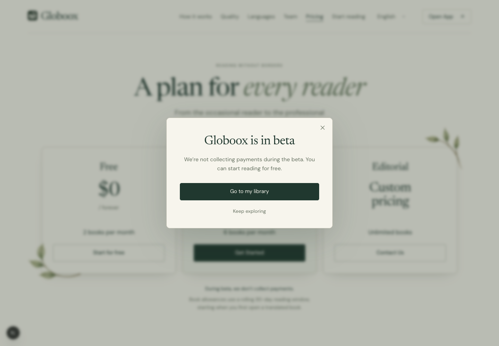
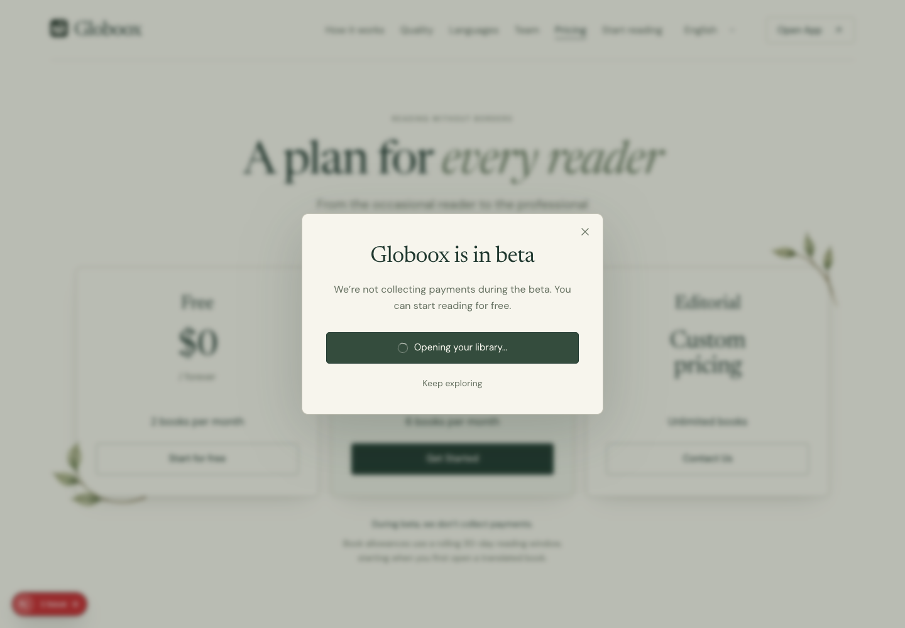
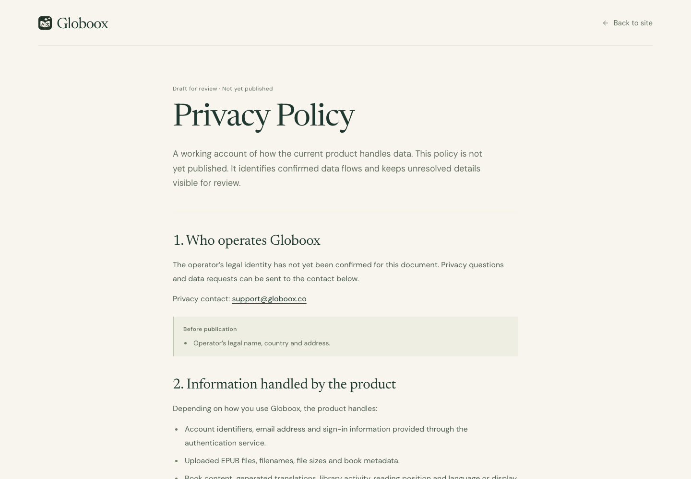

# Replacement preparation — implemented in preview

**Latest correction — 2026-09-14:** User rejects the added first-translation wait note. Remove it from desktop/mobile Step2 and all four locale dictionaries, preserving original step copy, media and motion. This supersedes the explanation described below; earlier screenshots/checks remain historical evidence. Removed from runtime and dictionaries. Browser verified all four locales at desktop/mobile; English Step2 screenshots visually reviewed.12 locale tests and scoped lint passed. Evidence: `docs/rfcs/active/globoox-editorial-2026/desktop-v2/replacement-preparation-2026-09-14/how-copy-correction-2026-09-14/README.md`. No commit or deployment.

User authorizes preparing the isolated editorial landing for future replacement, explicitly WITHOUT replacing the public landing or deploying. The later steering also requests Terms of Use and Privacy Policy pages. Earlier visual authority, canonical copy, current assets, and unrelated edits are preserved. Old project visuals remain secondary; old canonical behavior is the functional baseline.

Technical preparation is implemented and browser-reviewed. Legal pages remain explicit review drafts because operator and backend details have not been confirmed. This is NOT authorization to publish or a claim that the legal documents are final.

Implemented:

- Four localized editorial previews and preserved locale/hash navigation; original locale copy is reused verbatim.
- Active-section navigation, mobile-menu resize reset, three-step walkthrough with a concise first-translation explanation.
- Explicit preview/published server and metadata modes; only preview is mounted, noindex/nofollow. Public routes stay untouched.
- Premium opens a beta explanation, with an explicit library link. No payment, entitlement mutation, timed redirect, or fake loader. Loader reflects user-initiated navigation only.
- Visible Terms/Privacy footer links and separate noindex preview draft pages. User confirmed `support@globoox.co` for service and personal-data requests. Operator identity/country and backend retention/provider details remain unconfirmed. Do not describe these documents as final approved policies.
- Consent route gate extended to editorial descendants, preserving all original path matches.

- Footer tagline is centered within the footer and its text is center-aligned, per the latest steering. Canonical wording is unchanged.

## Review URLs

- `/landing-editorial` and `/landing-editorial/en`
- `/landing-editorial/fr`, `/landing-editorial/ru`, `/landing-editorial/es`
- `/landing-editorial/legal/terms`
- `/landing-editorial/legal/privacy`

All routes remain preview-only, `noindex, nofollow`, with self canonicals. Unknown locale returns404. No existing public locale page, root redirect, middleware, sitemap or robots route was changed. The consent-path matcher is the narrow documented infrastructure exception: it now covers all editorial descendants while preserving the old path behavior and excluding similarly named/product routes.

## Beta interaction

Premium's Get Started opens a native modal dialog with the existing paper/green typography and frame treatment. No automatic countdown or timed navigation is introduced. The user can close with Escape, the close button, the backdrop, or the secondary action. Focus remains in the dialog; closing returns it to the trigger. Background scrolling is locked only while open.

English copy:

> Globoox is in beta
>
> We’re not collecting payments during the beta. You can start reading for free.

Actions: **Go to my library** and **Keep exploring**. Russian: **Globoox сейчас в бете** / **Во время беты мы не взимаем плату. Можно начать читать бесплатно.** / **Перейти в библиотеку** / **Остаться на сайте**. French and Spanish equivalents are included.

The library link navigates to the existing `/my-books`. Its spinner and “Opening your library…” state begin only when the visitor chooses navigation. No checkout, charge, entitlement change or premium-access promise is added. A visible note below the pricing cards says that no payments are collected during beta; existing working prices and allowances remain the marketing reference, not a billing implementation.

## Localization and navigation details

Existing `getLandingMessages(locale)` remains the canonical marketing-copy source. New editorial-only labels, pricing and beta microcopy are isolated. Hero sentences are sliced without changing characters; all four locales have copy-preservation tests. The Russian hero lead now balances its lines rather than leaving «книг» alone. Cyrillic fallback families remain unchanged outside the already-approved language-specific Quality font calibration.

The selector now includes Español, correcting the old canonical selector omission that otherwise displayed English on the Spanish route. Locale links stay in the preview family and preserve the current URL hash. The locale preference cookie and document language follow the selection. Menu active state uses `aria-current="location"`, stays at the chosen destination during compact transit, and recomputes on arrival or interruption.

The header now collapses at **1100px**, with menu-state reset above1100px. The previous1000px boundary could clip the longer Russian Open App label at1001px; final28 width/locale measurements contain no header overflow. Header heights still change at900px; hero media/device breakpoints and botanical geometry are unchanged.

How it Works retains the three-step Stack and mobile portrait episodes. It uses the canonical localized real screenshot mapping (English locale Spanish→English; others English→selected language) and adds an explanatory note within Step2: the first translation takes a moment, with subsequent translation as the reader reads. There is no timing guarantee or return of the old five-state motion. Quality keeps its handle-only wipe, keyboard controls, Hide/Show and full excerpt; source/translation content comes from each original locale's dictionary.

## Terms and Privacy draft status

Both English documents are accessible without signing in and clearly say **Draft for review · Not yet published**. Their8 sections are readable HTML with sticky navigation, cross-links and confirmed support mailto links. No effective date is invented. English is deliberate at this stage: the original legal bodies were also English on all locales; final legal localization should follow confirmed content.

The original `TERMS_SECTIONS` / `PRIVACY_SECTIONS` in `src/components/landing/Footer.tsx` are untouched and retained as provenance. The new drafts do not copy their prospective purchases, audio and publishing claims. They describe verified account/book/cloud-processing/cache/analytics behavior, including that analytics are not exclusively anonymous and book deletion from the UI is not proof of complete backend erasure.

Still needed before final legal publication:

1. Operator legal name, country/address and applicable contractual details.
2. Actual production AI provider, processing locations and data-processing arrangements.
3. Retention, backups, complete deletion/account-request processes and applicable legal bases/rights.
4. Eligibility and final service terms.

The user's “Да, можно использовать” confirmed **only the support email**; it did not supply operator or jurisdiction data. The draft does not imply these facts are known. The privacy-information structure was cross-checked against the [European Commission’s information for organisations](https://commission.europa.eu/law/law-topic/data-protection/information-business-and-organisations/obligations_en); this is a structural reference, not a determination that a particular jurisdiction applies to Globoox.

Source facts were checked in `UploadBookModal.tsx`, `api.ts`, `contentCache.ts`, `useBooks.ts`, `PostHogProvider.tsx`, `posthog.ts`, `cookieConsent.ts`, the application layout and Sentry configurations. No backend/provider retention guarantees can be established from this frontend repository alone. No email was sent and no account was changed.

## Future activation — explicitly not performed

`EditorialLandingServer` accepts explicit `preview` or `published` mode. Every mounted editorial route passes `preview`. The unused published mode preserves the existing Supabase auth check/redirect and delegates to existing localized metadata and WebApplication JSON-LD helpers; it is covered by mocked server tests.

A future separate replacement change would update `src/app/[locale]/page.tsx` to call the published metadata helper and render `EditorialLandingServer` in published mode. Its old manual WebApplication script must then be removed to avoid duplicate output, along with the old landing stylesheet import. Final legal documents/public routes and their footer destinations must be decided before that activation: current legal links intentionally remain review URLs. No environment flag silently switches the public site.

## Verification and limits

- **87 focused tests passed**: hero-copy preservation, locale rendering/media/excerpts, navigation geometry, explicit server routing/auth/metadata, legal preview metadata and consent route boundaries.
- Scoped ESLint passed. Full TypeScript has only the existing duplicate `.next/types/routes.d 2.ts` declarations and backup-page prop errors; no new editorial/legal errors. Full production build is not claimed. See `evidence/typescript.log`.
- Independent Chrome navigation QA: five trips,186 transit frames with no active-state flicker, forward/reverse1→2→3→2→1, interruption, bottom-clamped Start, mobile-menu reset and French/Russian hash preservation. Nine nav captures reviewed.
- Four locales captured at1440 and390px;28 additional locale/width measurements at1440/1200/1100/1001/901/801/320. Follow-up review covered RU/FR Step2 at801 and all four mobile footers. These checks do not claim a new exhaustive hero device×breakpoint visual matrix; media framing and botanicals were not changed.
- Beta dialog: all four languages, mobile/desktop fit, Escape/focus return, focus containment, backdrop/secondary close, no automatic redirect, background scroll lock and actual navigation to `/my-books`. The loader capture uses a500ms delay **in the QA network interception only**, not in shipped code.
- QA caught and fixed a real accessible-name issue: wrapping the link text in `role="status"` made the library link unnamed. It now has normal text and a separate live status announcement; the browser locates and activates it by its visible name.
- Legal pages:200 without auth, self canonical/noindex, cross-links and mailtos, sticky header and no overflow at1440/390/320. Contact-final screenshots supersede earlier placeholders.
- Footer tagline centered at1440/320 in all four locales; original text retained. Final screenshots include normal Next development indicators where present.

`evidence/*.json`, `evidence/navigation/`, `evidence/legal/` and `checks/` contain reproducible measurements and accepted captures. Initial `visual-measurements.json` predates the Spanish selector/Russian hero fix; final `edge-measurements.json` and centered-footer evidence supersede those fields/layouts. First beta test attempts were not accepted evidence: an initial scroll/hydration wait and the unnamed link were corrected before the successful `beta-checks.json` run.

Authenticated backend/library operations, real payments, production telemetry delivery and physical Safari/iOS were not exercised. No new asset generation, commit, push, deploy or public landing replacement occurred. Unrelated billing RFC and previous work remain untouched.
