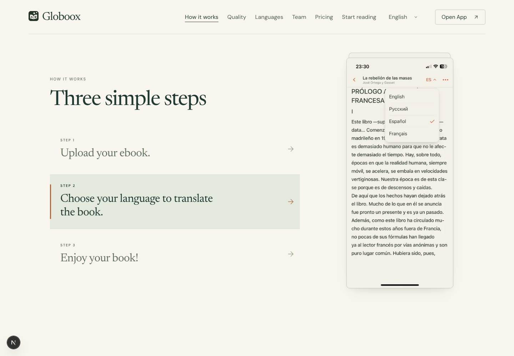
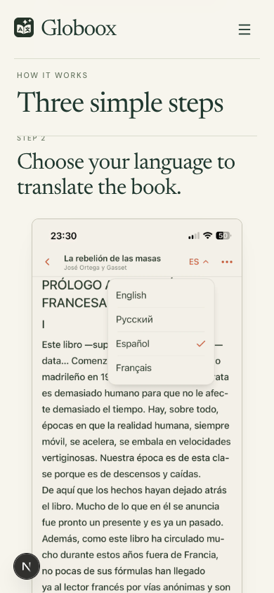

# Remove the unrequested walkthrough note

User rejects the first-translation explanation added during replacement preparation. It was assistant-written copy inspired by an old demo frame, not canonical landing text. Removed both desktop/mobile renderings, all four localized dictionary entries and their unused CSS. Only original step labels/descriptions remain. Existing real screenshots, Stack/mobile behavior and other sections are unchanged.

Fresh browser checks confirmed the original three desktop step labels/descriptions and the mobile Step2 text in EN/FR/RU/ES, with zero extra note elements; see `checks.json`. English desktop/mobile Step2 captures were visually inspected. The mobile capture is mid-scroll, with the sticky heading covering the passing label at its boundary; no motion or sticky change was made.12 existing locale tests and scoped ESLint passed. Previous wait-note approvals/descriptions/captures are superseded history; do not restore that copy from old records. No commit, deployment or public landing replacement.

