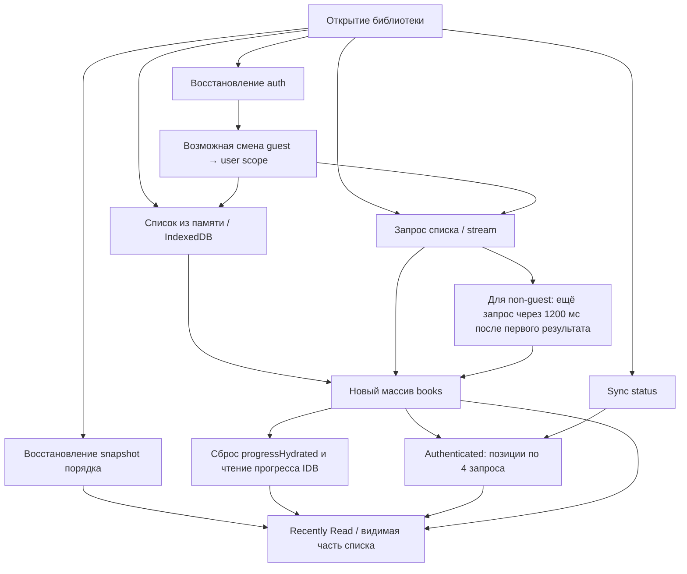

# Библиотека Globoox: мигание и повторная перестановка книг

Дата: 2026-09-15. Режим: диагностика без исправления исходников.

**Главный вывод.** Готовность библиотеки разнесена между несколькими независимыми процессами: авторизацией, восстановлением списка, восстановлением порядка, локальным прогрессом, серверным прогрессом и загрузкой обложек. Каждый процесс может публиковать промежуточное состояние. В Recently Read есть конкретный механизм возврата от актуального порядка к старому snapshot и обратно. Дополнительно разные состояния загрузки имеют разную геометрию. Поэтому «мигание» объединяет несколько разных явлений, а не одну CSS-анимацию.

## Границы доказательств

| Параметр | Проверено / ограничение |
|---|---|
| Код | Локальная ветка `dev`, HEAD `687d87b` на момент проверки. Исходники приложения не менялись. |
| Runtime | `https://dev.globoox.co/my-books`, Chrome, viewport 1470×843, гостевая библиотека из 6 книг. |
| Авторизация | Доступная диагностическая сессия не авторизована; ответы имеют `x-authenticated: false`. Перестановку конкретной пользовательской библиотеки в этой сессии не воспроизвёл. |
| Соответствие деплоя | Runtime сопоставлен с локальными путями и поведением. Точный SHA исполняемого production bundle отдельно не извлекался. |
| Измерения | Один reload с временными JS-пробами; отдельный Performance trace без этих проб, без искусственного ограничения CPU/сети. Это лабораторные замеры, не полевые процентили. |
| Backend | Изучен frontend proxy. Исходный код удалённого backend и его БД-запросы в этой проверке недоступны. Время API нельзя целиком объявлять временем SQL. |
| Сохранённые материалы | `dev-warm-events.json`, `observe-library.js`, `dev-performance-insights.json`. Полный raw Chrome trace не экспортирован; сохранены выданные инструментом метрики и insights. |
| Изменения | Только новые диагностические файлы в этой папке. Не менялись код, конфигурация, прежние документы, библиотеки пользователей. Нет коммита, push или deploy. Обычное открытие страницы выполняет её штатные запросы и кеширование. |

Уровни уверенности ниже: **runtime** — наблюдалось в браузере; **код** — непосредственно следует из текущей реализации; **условно** — путь существует, но для его срабатывания нужны оговорённые данные или тайминги.

## Карта источников и процессов

| Источник / процесс | Когда запускается | Что публикует | Что может менять на экране | Опора в коде |
|---|---|---|---|---|
| Route loading | До готовности страницы | Skeleton фильтров и 6 обложек | Начальную геометрию | `src/app/(app)/my-books/loading.tsx:1` |
| `useAuth` | Mount каждого экземпляра; auth events | `user`, `loading`, права профиля | Scope библиотеки, фильтры, действия | `src/lib/hooks/useAuth.ts:14`, `:96` |
| Кеш списка в памяти | Синхронно при mount | `books`, начальный `loading` | Мгновенно видимые книги при возврате внутри приложения | `src/lib/useBooks.ts:15`, `:32` |
| Список в IndexedDB | Отдельный effect, если памяти нет | `books`, `loading=false` | Книги до завершения сети | `src/lib/useBooks.ts:62` |
| Snapshot порядка | Память синхронно, IndexedDB асинхронно | `recentlyOpenedSnapshotOrder` | Порядок Recently Read, пока `progressHydrated=false` | `src/app/(app)/my-books/page.tsx:133`, `:162` |
| Локальный прогресс Zustand | Persist storage + обновления reader | `progress[bookId]` | Fallback прогресса и времени чтения | `src/lib/store.ts:182`, `:239`; `page.tsx:417` |
| Прогресс IndexedDB | **На каждое изменение reference массива `books`** | `progressData`, `progressHydrated=false→true` | Прогресс и переключение алгоритма сортировки | `page.tsx:233` |
| Список по сети | Независимый mount effect / stale visibility refresh | Каждый stream batch; итоговый список | Состав списка и новый запуск гидратации прогресса | `src/lib/useBooks.ts:89`, `:127`, `:188` |
| Auth retry | Первый сетевой цикл в non-guest scope | Ещё один полный список | Ещё один цикл прогресса/сортировки | `src/lib/useBooks.ts:154` |
| Серверный прогресс | После появления книг у authenticated user | Объединённые позиции после всех волн запросов | Позднюю перестановку Recently Read и полоски прогресса | `page.tsx:301` |
| Sync status | Mount / возврат вкладки, минимум 30 секунд между проверками | Invalidation кешей + версии в Zustand | Новую проверку прогресса; потенциальные гонки с кешем | `src/lib/hooks/useSyncCheck.ts:28` |
| Определение пропорций обложки | Effect каждой карточки без aspect cache | Размер внутренней рамки | Контур обложки, тень, положение меню внутри фиксированного слота | `src/components/Store/BookCard.tsx:185` |
| Cache epoch | При отсутствующей/другой версии кеша | Очистку кеша, полный reload | Однократное повторение всей загрузки | `src/components/SyncCheckClient.tsx:28` |

Нет общей операции «восстановить согласованные список + scope + порядок + timestamps и затем показать». `loading=false` означает наличие списка, а не завершение всех процессов, от которых зависит его финальный вид.

## Причина 1 — сортировка возвращается к старому состоянию

**Уверенность: код; видимое проявление условно. Приоритет: основной для повторной перестановки.**

В `page.tsx:233` эффект подписан на `[books, scopeKey]`. Каждый новый массив книг вызывает `setProgressHydrated(false)`, N чтений позиций из IndexedDB через `Promise.all`, затем `setProgressHydrated(true)`.

Этот флаг используется не только как индикатор загрузки. В `page.tsx:442` он переключает два разных правила сортировки:

- false + непустой snapshot: сохранённый порядок предыдущего состояния;
- true: расчёт по времени последнего чтения;
- при отсутствии timestamps второе правило использует лексикографический ID, а первое для неизвестных книг использует сначала дату создания. Даже fallback различается.

После расчёта актуального порядка `page.tsx:467` записывает его в `savedSnapshotOrderRef` и кеш. **State `recentlyOpenedSnapshotOrder`, из которого построен `snapshotRank`, при этом не обновляется.** Он загружается при смене scope/sort и отдельно меняется по открытию книги (`:670`). Поэтому fallback текущего mount способен оставаться старым.

Пример существующего пути, не измерение пользовательских данных:

| Шаг | Состояние | Видимый порядок при отдельном paint |
|---|---|---|
| 1 | Snapshot содержит A, B; timestamps дают B, A; прогресс готов | B, A |
| 2 | Пришёл новый массив книг, даже с тем же содержимым | Пока B, A |
| 3 | Effect сбросил `progressHydrated=false` | **A, B** — возврат к старому snapshot |
| 4 | IndexedDB завершился, флаг true | **B, A** — повторный расчёт |

`commitBooks` в `useBooks.ts:45` не сравнивает содержимое до `setBooks`. Поэтому идентичный повторный JSON — достаточный источник нового reference и повторного эффекта. Сравнение содержимого в IDB write helper происходит позже и не отменяет React update.

Ограничения: нужны Recently Read, непустой snapshot и различие порядков. React может объединить несколько обновлений; промежуточный false не обязан попасть в отдельный видимый кадр. Если предыдущий проход ещё идёт, следующий массив может лишь продлить false. Cleanup отменяет применение результатов старого IDB-прохода. Поэтому нельзя обещать фиксированные «три мигания» или видимый скачок на каждом batch. В записанном гостевом warm-прогоне порядок всех шести книг сохранялся.

## Причина 2 — список приходит несколькими независимыми публикациями

**Уверенность: код; часть последовательности наблюдалась runtime.**

1. `useBooks.ts:62` начинает восстановление IndexedDB, а `:188` независимо вызывает `refresh()`.
2. `refresh` проверяет память **до** завершения IndexedDB. Если памяти ещё нет, начинается запрос, даже когда сохранённый список вот-вот появится. В измерении карточки уже видны на 614 мс, а сам `fetch` списка стартует на 624 мс: решение о запросе было принято раньше, до IDB; перед fetch также ожидается получение browser token.
3. Каждый NDJSON batch публикуется через `setBooks([...streamed])`, без ожидания хвоста списка. После завершения возможна ещё итоговая публикация другого массива.
4. Для non-guest scope первый сетевой цикл дополнительно делает ещё один `fetchBooks` через **1200 мс после первого результата**, даже если тот успешно пришёл. Это текущая компенсация auth race, а не retry только по ошибке.
5. Каждая новая публикация способна снова запускать Причину 1 и прерывать/перезапускать получение серверного прогресса.

Поздний ответ по этой схеме приходит примерно в `T_первого_результата + 1200 мс + T_второго_запроса`, а не ровно через 1,2 секунды от открытия страницы. При многосекундном API это объясняет перестройку уже после того, как пользователь считает библиотеку загрузившейся.

Дополнительная гонка: IDB callback проверяет отмену эффекта и наличие данных, но не проверяет, применялся ли уже более свежий сетевой результат для этого же scope. Если IDB окажется позднее сети, старый список может перезаписать новый. Этот путь существует в коде, но не наблюдался в записанном замере: IDB был быстрее.

`/api/books*` специально исключены из общего кратковременного response-cache и объединения одинаковых in-flight запросов (`src/lib/api.ts:274`). Ref `revalidating` защищает отдельный экземпляр hook, а не все потребители API и не обе стадии auth retry.

## Причина 3 — сведения для Recently Read догружаются после самих книг

**Уверенность: код. Authenticated runtime в этой проверке не измерен.**

`page.tsx:301` выбирает первые `visibleCount + 6` ID из **исходного массива**, до окончательной сортировки/фильтрации. При стартовом `visibleCount=6` это до 12 книг. Запросы позиций идут волнами по 4: следующая волна ожидает всю предыдущую. Для 12 книг — до трёх последовательных волн. Время этапа примерно равно сумме длительностей самых медленных запросов каждой волны, если ответы не попали в отдельный 30-секундный position cache.

React `progressData` обновляется после всех волн. До этого библиотека может несколько секунд отображать порядок по неполным локальным сведениям, потом перестроиться по серверным. Новый массив `books` отменяет этот effect и начинает его заново; ID помечаются проверенными лишь после полного прохода. Поэтому частично законченные проверки могут повторяться, хотя уже завершённые ответы иногда обслужит position cache.

Кроме того, `getEffectiveLastRead` в `page.tsx:417` выбирает **первый существующий timestamp** в порядке `server_updated_at → idb_updated_at → Zustand.lastRead`. Это не выбор самого нового времени. Например, при server=вчера и локальном открытии=сейчас предпочтение получит вчера. После возврата из reader локальный порядок и порядок после гидратации поэтому могут расходиться. `mergeProgressMonotonic` смягчает регресс внутри `progressData`, но не меняет это правило приоритета источников.

Сам snapshot хранит ещё `effectiveLastReadByBookId`, но страница при восстановлении берёт из него только `order`. Значит, сохранённый порядок и временные метки, которыми он был рассчитан, не восстанавливаются как единое состояние.

## Причина 4 — stream и сортировка меняют видимую шестёрку

**Уверенность: код, зависит от состава книг.**

В `page.tsx:431` сначала сортируется весь доступный список. И только затем `:486` берёт его первые `visibleCount` элементов. Новый batch поэтому не обязательно добавляется ниже. Книга из хвоста потока может попасть наверх и вытеснить ранее видимую книгу из первых шести.

React key задан правильно — `book.id` (`:658`). Общие книги переупорядочиваются с сохранением identity. Но вытесненная за видимый предел карточка действительно unmount, новая mount. Это уже способно восприниматься как исчезновение/появление обложек. Порядок и размер фактических backend batch без серверного кода не считаю доказанными.

## Причина 5 — геометрия loading и готовой библиотеки различается

**Уверенность: код + runtime.**

Route fallback рисует 6 заглушек обложек и 4 заглушки управления. После mount страницы остаются 6 заглушек обложек с настоящими controls. Финальная карточка содержит не только обложку 2:3, но и нижний отступ, заголовок до двух строк и автора. Skeleton этой высоты текста не резервирует. Поэтому меняются высота ряда, положение следующего ряда и футера.

Дополнительно controls отображаются при `authLoading || isAuthenticated` (`page.tsx:533`). При определении гостевой сессии они удаляются, а ниже появляется гостевой CTA. В записанном warm-прогоне верх секции книг переместился с **175,5 до 106 px**, то есть на **69,5 px вверх**. Это не перестановка ID, а отдельный layout shift.

Для вошедшего пользователя удаление controls не должно происходить в таком же виде. Но при холодной загрузке auth изначально неизвестен, библиотека уже запускается с guest scope (`page.tsx:114`). Смена на user scope может поставить `loading=true`, и ветка `:645` заменит грид заглушками. Видимое проявление зависит от наличия кешей и скорости auth; в этой гостевой сессии такой переход не измерен.

## Причина 6 — пропорции обложек уточняются после первого render

**Уверенность: код + измеренные размеры/декодирование; визуальный скачок на тёплом aspect cache не наблюдался.**

`useImageAspect` читает localStorage по хешу source. Если значения нет, запускает `new Image().decode()` и затем вычисляет naturalWidth/naturalHeight. До этого внутренняя рамка заполняет 2:3 слот целиком; после получения aspect она может стать уже или ниже. `isReady` возвращается true даже до завершения decode (`BookCard.tsx:235`).

Фиксированный внешний слот означает, что это меняет прежде всего контур обложки, тень и привязанное меню, а не порядок/количество колонок. В измерении реальные обложки имели размеры до **1466×2200 px** при показе примерно **204×306 px**. Они передаются как inline base64 JPEG вместе со списком. Для шести книг API переносил около 2,84 МБ.

В файле есть `useCompressedCover` и `useCoverAccent`, но текущая `BookCard` их не вызывает: используется `displayCover = sourceCover`, цвет вычисляется из ID/title. Нельзя объяснять проблему якобы последовательной заменой сжатой и оригинальной картинки или активным canvas-анализом цвета — этих путей в текущем render нет.

В журнале есть повторные DOM `load` events изображений. При этом node identity, source и геометрия были стабильны. Одни эти события не доказывают повторную сетевую загрузку, unmount или видимое мигание; у inline источников отдельного HTTP-запроса обложки нет.

## Измеренная последовательность: reload с сохранённым IndexedDB

Источник: `dev-warm-events.json`. Время относительно начала navigation, миллисекунды. Наблюдатели добавляют некоторую нагрузку; это один прогон.

| Время | Наблюдение | Что это доказывает |
|---:|---|---|
| 479,2 | 0 карточек, 10 `.animate-pulse` элементов: 6 обложек + 4 controls | Отдельный route loading |
| 505,0 | 0 карточек, 6 заглушек, controls уже настоящие | Следующее промежуточное loading состояние |
| 504,0 | First paint / FCP по PerformanceEntry | Первое визуальное содержимое ещё не финальная библиотека |
| 546,6–553,0 | IDB чтения списка и snapshot завершились | Список из кеша доступен до сети |
| 548,5 | Старт `/api/sync/status` | Sync не ожидает завершения списка |
| 614,3 | Все 6 карточек из кеша, заглушек нет, controls гостя убраны | Раннее появление библиотеки |
| 619,1 | Layout shift 0,0900; секция перемещается 175,5→106 px | Реальная смена геометрии |
| 618,8–651,4 | Decode обложек: около 20–51 мс каждая, операции перекрываются | Нельзя складывать их длительности как последовательную задержку |
| 622,8–645,9 | 6 IDB чтений reading positions; ни одной записи для этих гостевых книг | Отдельная стадия прогресса после списка |
| 623,6 | Старт `/api/books?status=active&stream=1` | Наличие уже показанного IDB списка не отменило запущенный refresh |
| 694,4–1425,4 | Main-thread long task ~731 мс | Могут задерживаться обработчики/отрисовка; функция-источник этим наблюдателем не установлена |
| ~1023,4 / 1426,8 | Sync network завершён / JS обработал response headers | Сетевая готовность и выполнение JS callback не одно и то же; главный поток был занят |
| 4121,8 | JS получил headers books stream | Серверный путь / сеть существенно медленнее локального отображения |
| ~5542,6 | Books transfer завершён; 2 844 429 байт, длительность 4918,9 мс | Фоновый список доходит почти через 5 секунд после fetch |
| 5559–5560 | Ещё 6 IDB чтений reading positions после сетевого обновления списка | Повторный запуск гидратации прогресса подтверждён непосредственно |
| 15458,7 | Конец записи | Во всём прогоне порядок и identity шести видимых книг сохранялись |

**Отдельный Performance trace без JS-проб:** LCP 463 мс, TTFB документа 69 мс, CLS 0,0555 (округлённо 0,06). Основной shift — секция книг/футер/правое действие шапки на 343 мс; ещё один — гостевой CTA на 420 мс. API списка снова занял около 4,95 секунды и перенёс 2,85 МБ. Chrome ThirdParties insight приписал PostHog около **779 мс исполнения на main thread** за этот trace. Это отдельный существенный источник нагрузки; нельзя отождествлять весь этот aggregate с конкретным 731-мс long task другого прогона или объявлять PostHog причиной изменения порядка книг.

## Синхронизация и дополнительные усилители

| Механизм | Факт и ограничение |
|---|---|
| Разовая epoch-перезагрузка | `SyncCheckClient.tsx:34` очищает persisted caches, `:47` вызывает полный `window.location.reload()`, если ключ отсутствует/отличается. Bootstrap не блокирует children. Возможен первый старт библиотеки параллельно очистке, затем второй старт всей страницы. Это не механизм каждого reload при совпадающем epoch. |
| Sync invalidation | `useSyncCheck.ts:49` очищает кеш списка; `:58` — позиций. Async удаления не ждут остальные загрузчики/записи. Это допускает гонки очистки и заполнения кешей. Но **очистка списка сама не вызывает новый React refresh**: `useBooks` не подписан на `syncVersions.library`. Комментарий про automatic fetch в `useSyncCheck` не соответствует этому wiring. |
| Метки проверенных позиций | Очистка `revalidatedBookIdsRef` (`page.tsx:393`) объявлена после effect revalidation (`:301`). При смене версии проход может увидеть прежние метки и вернуться до их очистки. Условный пропуск проверки до следующего триггера, не установленная причина текущего мигания. |
| Свежесть IDB списка | `contentCache.ts:381` не обновляет `fetchedAt`, если содержимое книг не поменялось. Сетевое подтверждение свежести не продлевает persisted TTL. После reload такой кеш выглядит старее, чем в действительности. В памяти TTL 5 минут работает отдельно. |
| Стоимость IDB | `withStore` открывает connection/transaction на операцию и закрывает её. Progress hydration читает все N книг; запись списка ещё пишет N metadata; API слой также пишет metadata в guest scope. Сравнения сериализуют объекты с base64 covers. Точные CPU costs этих операций отдельно не профилированы. |
| Широкая Zustand-подписка | `page.tsx:113` и `useSyncCheck.ts:23` читают весь store без selector. Не относящееся к гриду изменение может вызвать render. Сам по себе render не означает ни новый запрос, ни пересоздание карточки, ни видимый кадр. |
| Auth на каждой карточке | `BookCard.tsx:386` вызывает `useAuth`. Module cache есть, но in-flight profile guard находится внутри экземпляра hook. При ещё не готовом profile cache разные экземпляры могут одновременно проверять один профиль. Это дополнительная работа; число таких запросов у вошедшего пользователя не измерено. |
| Browser/proxy auth | Browser отправляет Bearer; `_proxy.ts:14` заново получает cookie session, формирует собственный Authorization и не пересылает входящий Bearer. Два источника auth не обязательно готовы одновременно. Наличие session-race retry подтверждает предусмотренный в коде обход, но частоту реальной гонки эта проверка не измеряет. |
| Abort | Проверка server positions имеет AbortController. Backend fetch внутри proxy не получает входящий request.signal (`_proxy.ts:41`). Прекращение ожидания на клиенте поэтому не гарантирует прекращение удалённой работы. |
| Shared guest | `getGuestScopeKey()` возвращает `share:<token>` для гостя по ссылке. `useBooks.ts:29` считает любой scope кроме буквального `guest` authenticated. Такой гость тоже может получить `status=all` и лишний 1200-мс retry. Нельзя интерпретировать этот флаг как фактическую авторизацию. |
| Семантика lastRead | `store.ts:193` ставит `lastRead=now` при фоновом обновлении server progress. Это время синхронизации, не обязательно чтения. В обычном ходе sorter предпочитает server timestamp, но fallback-данные семантически загрязняются. |

## Почему проявляется по-разному

| Сценарий | Ожидаемые источники нестабильности по коду |
|---|---|
| Hard reload, сохранённый кеш | Память пуста → IDB и сеть параллельно; отдельное восстановление snapshot/прогресса; возможная auth scope смена; новый список через секунды. |
| Первый визит / новый epoch | Всё выше без надёжного кеша, плюс разовая очистка и полная перезагрузка. |
| Возврат из reader внутри SPA, кеш моложе 5 минут | Список обычно уже в памяти, обязательного сетевого списка нет. Но локальное чтение, snapshot и server-first timestamps могут расходиться; позиции могут снова проверяться. |
| Возврат с устаревшим кешем / возвращение вкладки | Показ старого списка плюс фоновая revalidation, независимый sync check, для нового hook возможен auth retry. |
| Recently Read | Дополнительно работают snapshot-переключение и поздние timestamps. |
| Title / Recently Added | Snapshot-переключение не применяется. Состав stream, scope, skeleton geometry и аспекты обложек остаются возможными причинами. |
| Большая библиотека | Больше batch/IDB операций, первые видимые книги могут заменяться после общей сортировки; позиции загружаются ограниченным набором, не обязательно соответствующим окончательному top. |

## Итоговая оценка

Основная архитектурная проблема — частичные результаты независимо меняют уже видимую библиотеку, причём флаг загрузки локального прогресса одновременно переключает правило сортировки. Сохранённый порядок должен был удерживать экран, но остаётся устаревшим в state и способен создавать повторный откат. Stream, unconditional auth retry и поздние timestamps дают этому несколько триггеров за одну загрузку.

Отдельно подтверждены нестабильная геометрия skeleton/controls, тяжёлый books payload и заметная сторонняя JS-нагрузка. Они увеличивают видимость промежуточных стадий и добавляют собственные сдвиги. Сводить всё к React StrictMode, случайным key, загрузке гарнитуры или одной медленной сети было бы неверно. В доступном runtime нет доказательства повторной перестановки пользовательских книг; есть доказанная повторная гидратация и измеренный layout shift. Для привязки точного числа скачков к конкретному аккаунту нужен его authenticated trace при воспроизведении.

Никаких исправлений не внесено.
